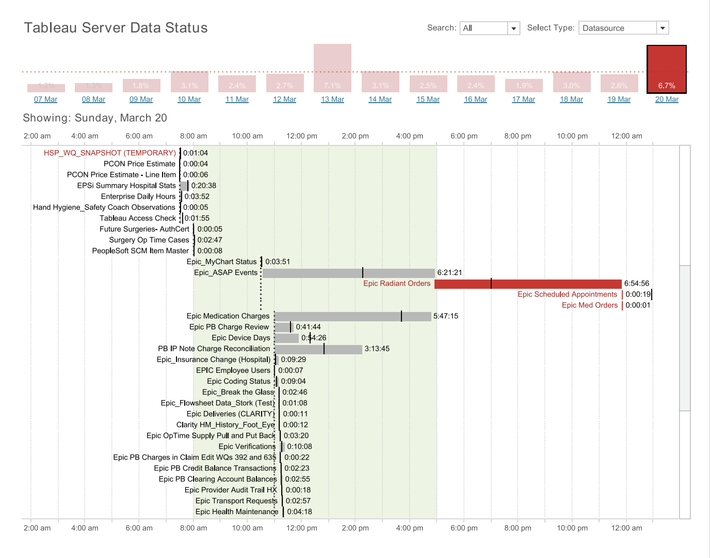
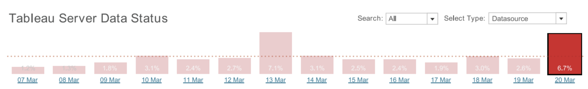
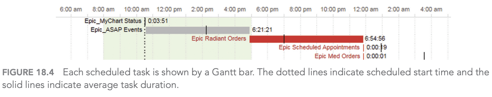
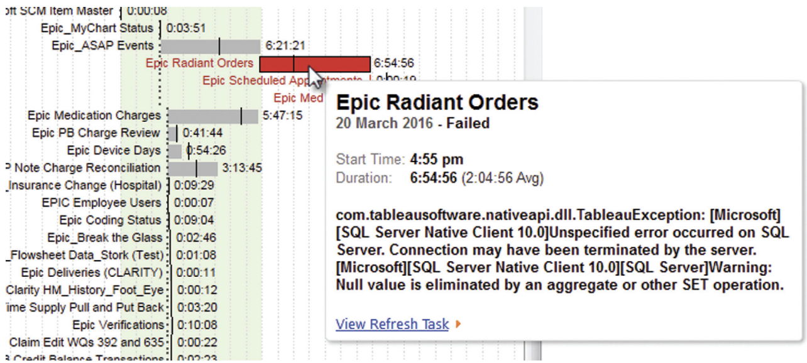
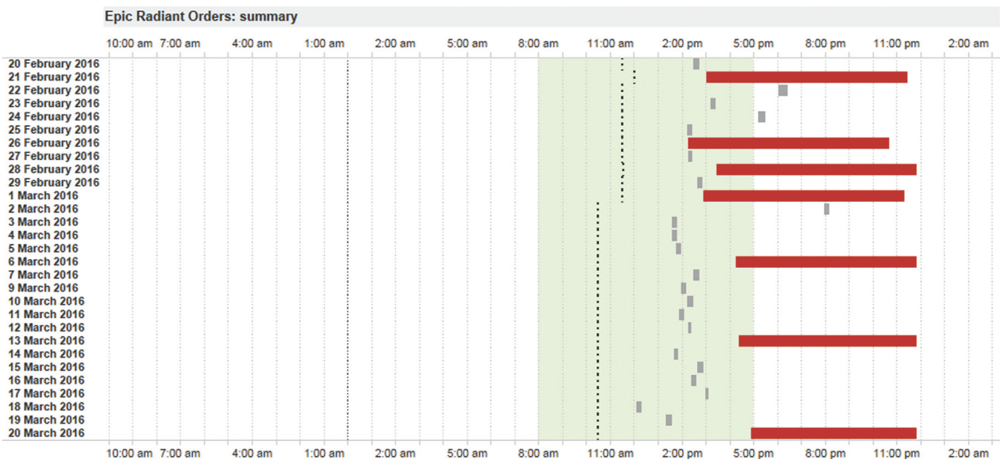
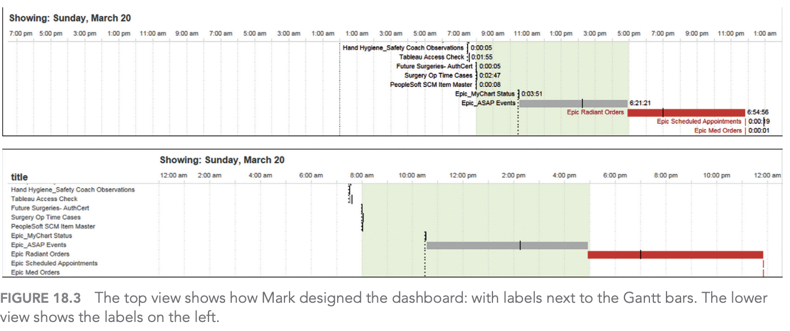
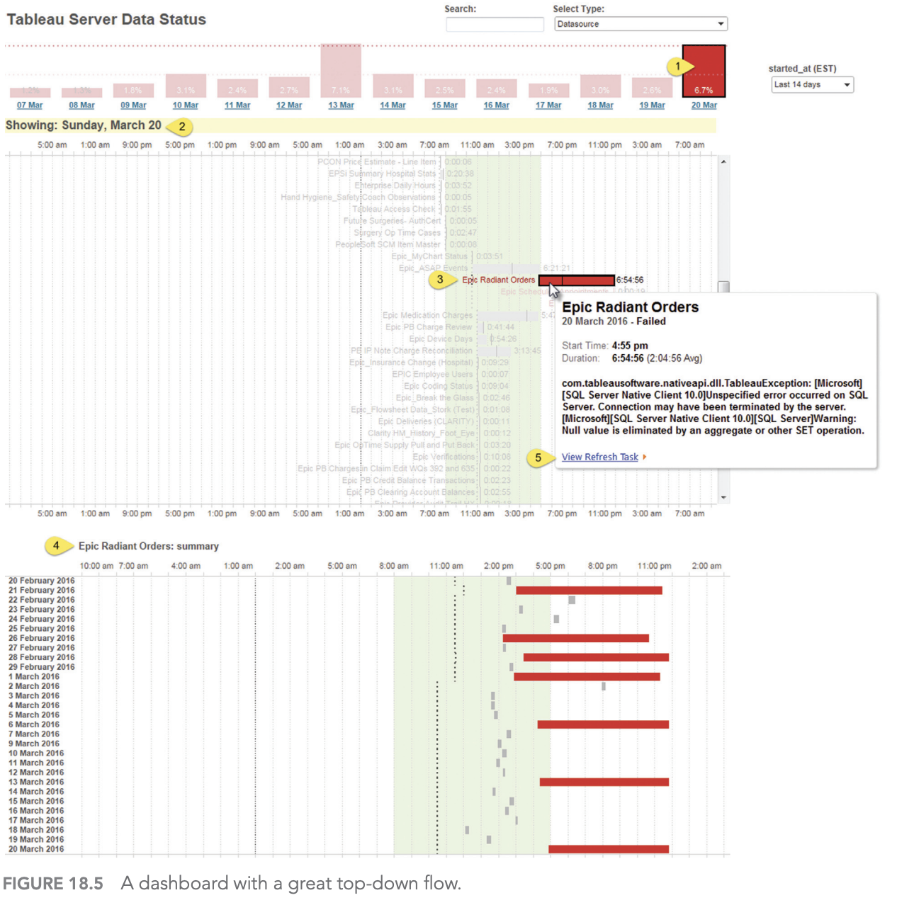

# Giám sát quá trình xử lý của máy chủ

Chapter 18: Server Process Monitoring

- Dashboard designer: Mark Jackson
- Organization: Piedmont Healthcare
- Chủ đề: dashboard giám sát tiến trình bị trễ hoặc thất bại trong ngày
- Thuyết trình bởi: Nhóm 2

<!--
Speaker notes:
Mở đầu bằng cách giới thiệu đây là một case study về dashboard vận hành hệ thống.
Trọng tâm của bài không phải là kỹ thuật server quá sâu, mà là cách một dashboard giúp người quản trị phát hiện vấn đề nhanh và đi thẳng đến hành động.
-->

---

## Bối cảnh nghiệp vụ

Một BI manager cần đảm bảo hệ thống dữ liệu:

- Online trước khi nhân viên bắt đầu ngày làm việc
- Có dữ liệu mới nhất sau các tiến trình chạy qua đêm
- Báo sớm nếu có tiến trình lỗi hoặc chạy chậm bất thường

**Vấn đề chính:** nếu phát hiện lỗi muộn, người dùng sẽ bị ảnh hưởng trước khi đội quản trị kịp xử lý.

<!--
Speaker notes:
Ở bối cảnh này, các tiến trình server thường chạy qua đêm để cập nhật dữ liệu.
Khi nhân viên đến văn phòng, họ kỳ vọng dashboard và báo cáo đã sẵn sàng.
Vì vậy người quản trị cần một màn hình kiểm tra nhanh mỗi sáng để biết có vấn đề gì xảy ra không.
-->

---

## Dashboard cần trả lời câu hỏi gì?

1. Các tiến trình server hôm nay có thành công không?
2. Tiến trình nào đã thất bại?
3. Các lỗi đó có lặp lại nhiều lần không?
4. Tiến trình nào đang mất nhiều thời gian hơn bình thường?

**Mục tiêu:** đi từ cảnh báo tổng quan đến nguyên nhân cụ thể càng nhanh càng tốt.

<!--
Speaker notes:
Đây là 4 câu hỏi định hướng toàn bộ thiết kế dashboard.
Điểm đáng chú ý là dashboard không cố trả lời mọi thứ.
Nó tập trung vào các câu hỏi vận hành quan trọng nhất: có lỗi không, lỗi ở đâu, lỗi có lặp lại không, và cần xử lý gì tiếp theo.
-->

---

## Dashboard tổng quan

Dashboard gồm biểu đồ cột 14 ngày, Gantt chart trong ngày và vùng xem chi tiết khi cần.

<!--
Speaker notes:
Slide này nên để ảnh chiếm phần lớn màn hình.
Giải thích nhanh bố cục: phần trên là tỷ lệ lỗi theo ngày, phần giữa là các tiến trình trong ngày theo timeline, phần dưới chỉ xuất hiện khi người dùng drill-down vào một task cụ thể.
Luồng đọc tự nhiên là từ trên xuống dưới.
-->

---

## Biểu đồ cột: phát hiện ngày bất thường

<ul>
  <li>Hiển thị tỷ lệ lỗi của <strong>14 ngày gần nhất</strong></li>
  <li>Ngày mới nhất nằm ở phía bên phải</li>
  <li>Đường nét đứt biểu thị <strong>mức lỗi trung bình</strong></li>
  <li>Ngày 20/3 có <strong>6.7% tiến trình thất bại</strong></li>
</ul>

<!--
Speaker notes:
Biểu đồ cột giúp Mark không cần đọc log chi tiết ngay từ đầu.
Chỉ cần so sánh cột hôm nay với hai tuần trước và với mức trung bình, ông có thể biết hôm nay có phải ngày bất thường không.
Con số 6.7% cao hơn trung bình, nên dashboard dẫn người dùng xuống phần điều tra cụ thể.
-->

---

## Biểu đồ Gantt: đọc trạng thái tiến trình

- Thanh **xám**: tiến trình thành công
- Thanh **đỏ**: tiến trình thất bại
- Đường **nét đứt**: thời điểm dự kiến bắt đầu
- Đường **nét liền**: thời lượng trung bình của tiến trình

<!--
Speaker notes:
Gantt chart phù hợp vì mỗi tiến trình đều có thời điểm bắt đầu, thời điểm kết thúc và thời lượng.
Người xem không chỉ biết task nào fail, mà còn thấy task đó bắt đầu trễ hay chạy lâu bất thường.
Trong ví dụ, Epic Radiant Orders vừa fail vừa bắt đầu trễ đáng kể.
-->

---

## Tooltip: thêm ngữ cảnh để xử lý lỗi

- Hover vào task để xem thông tin chi tiết
- Cho biết thời gian chạy, trạng thái và mô tả lỗi
- Có URL để đi thẳng đến hệ thống/server liên quan

**Ý nghĩa:** dashboard không chỉ báo lỗi, mà còn rút ngắn bước điều tra tiếp theo.

<!--
Speaker notes:
Tooltip là chi tiết nhỏ nhưng rất quan trọng.
Nếu dashboard chỉ nói một task bị lỗi, người quản trị vẫn phải tự tìm nơi xử lý.
Ở đây tooltip cung cấp ngữ cảnh và link trực tiếp, giúp chuyển từ phát hiện sang hành động.
-->

---

## Detail view: lỗi có lặp lại không?

- Xem lịch sử riêng của một tiến trình trong khoảng 1 tháng
- Epic Radiant Orders đã thất bại **7 lần**
- Các lần lỗi thường gắn với việc bắt đầu muộn

**Kết luận:** đây có thể là lỗi có tính hệ thống, không phải sự cố đơn lẻ.

<!--
Speaker notes:
Sau khi biết Epic Radiant Orders fail trong ngày hôm nay, Mark cần biết đây là lỗi mới hay lỗi lặp lại.
Detail view trả lời câu hỏi đó bằng lịch sử một tháng.
Nếu một tiến trình fail 7 lần, đội quản trị cần điều tra nguyên nhân gốc thay vì chỉ xử lý tạm từng lần.
-->

---

<!-- _style: "img { max-height: 430px !important; } @media (min-height: 900px) { img { max-height: 56vh !important; } }" -->

## Vì sao đặt nhãn ngay trên Gantt bar?

- Cách phổ biến: đặt tên task ở lề trái
- Cách Mark chọn: đặt nhãn gần ngay thanh Gantt
- Khi thấy thanh đỏ, mắt người xem thấy luôn tên tiến trình

**Đánh đổi:** hơi rối hơn, nhưng phản ứng nhanh hơn.

<!--
Speaker notes:
Đây là một quyết định thiết kế đáng phân tích.
Về mặt thẩm mỹ, đặt nhãn sát thanh có thể làm biểu đồ bận hơn.
Nhưng với dashboard vận hành, tốc độ nhận diện vấn đề quan trọng hơn sự gọn gàng tuyệt đối.
Người dùng thấy lỗi ở đâu thì thấy luôn tên task ở đó.
-->

---

## Luồng khám phá dữ liệu

1. **Overview:** xem hiệu suất server những ngày gần đây
2. **Zoom/filter:** chọn một ngày có vấn đề
3. **Details on demand:** click task để xem chi tiết hoặc mở URL xử lý

<!--
Speaker notes:
Luồng này bám sát nguyên tắc của Ben Shneiderman: overview first, zoom and filter, then details on demand.
Điểm mạnh là người dùng không bị ném ngay vào chi tiết.
Họ bắt đầu từ tổng quan, rồi chỉ đi sâu vào phần có vấn đề.
-->

---

## Điểm mạnh và hạn chế thiết kế

<h3>Điểm mạnh</h3>
<ul>
  <li>Đơn giản, ít thành phần thừa</li>
  <li>Trả lời đúng 3 câu hỏi chính mỗi sáng</li>
  <li>Dẫn người dùng từ cảnh báo đến hành động</li>
  <li>Dùng màu đỏ/xám rõ nghĩa</li>
</ul>

<h3>Hạn chế</h3>
<ul>
  <li>Một số nhãn bị chồng lên đường tham chiếu</li>
  <li>Gantt chart có thể rối nếu nhiều tiến trình hơn</li>
  <li>Phù hợp với người dùng cá nhân hơn là toàn tổ chức</li>
</ul>

<!--
Speaker notes:
Andy nhận xét dashboard này đơn giản và đó chính là lợi thế.
Nó không cố nhồi nhiều biểu đồ, mà tập trung vào bar chart và Gantt chart.
Tuy vậy vẫn có lỗi thẩm mỹ: chữ có thể chồng lên các đường tham chiếu.
Nếu dashboard chỉ dùng cho Mark thì chấp nhận được, nhưng nếu triển khai cho cả tổ chức thì cần chỉnh kỹ hơn.
-->

---

## Kết luận

### 3 bài học chính

1. Dashboard tốt bắt đầu từ **câu hỏi nghiệp vụ rõ ràng**
2. Thiết kế hiệu quả cần dẫn người dùng từ **tổng quan đến chi tiết**
3. Với dashboard vận hành, giá trị lớn nhất là **phát hiện nhanh và hành động nhanh**

Q&A

<!--
Speaker notes:
Kết bài bằng cách nhấn mạnh đây là dashboard đơn giản nhưng hiệu quả.
Nó giúp người quản trị biết có vấn đề, biết vấn đề ở đâu, biết lỗi có lặp lại không và có đường đi để xử lý.
Nếu còn thời gian, có thể mở câu hỏi: Nếu dashboard này dùng cho toàn công ty, chúng ta sẽ cải tiến điểm nào?
-->
