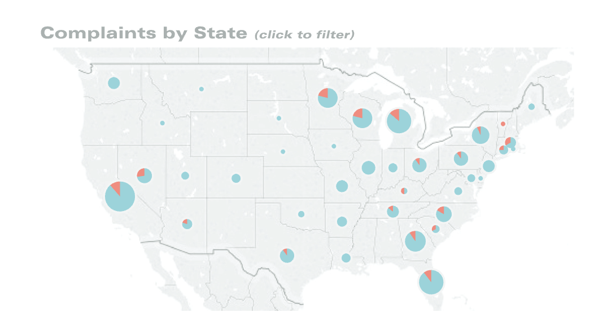
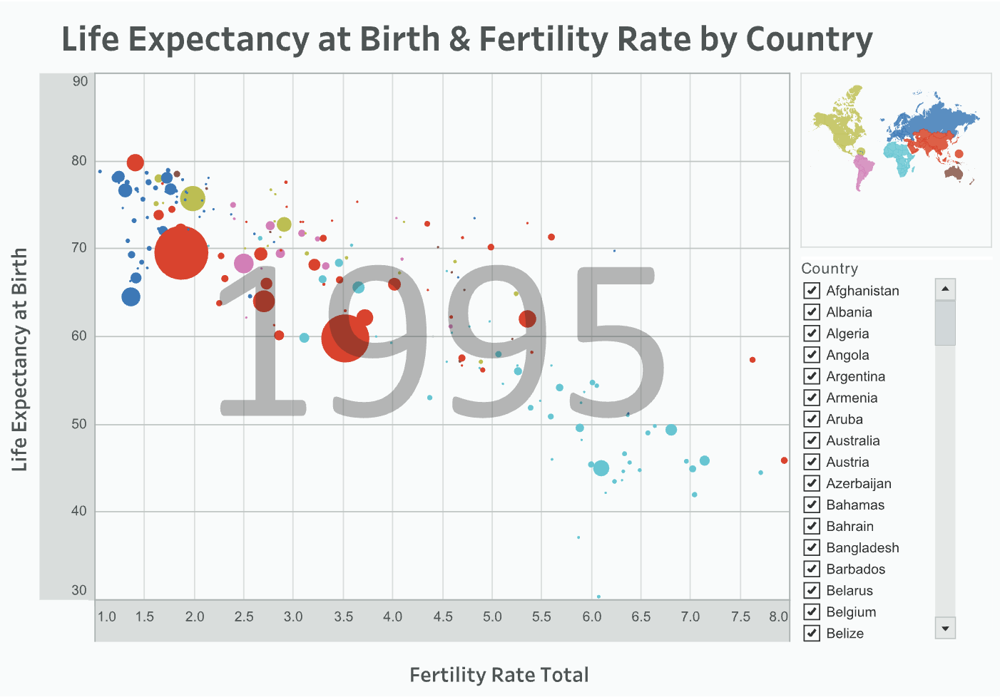
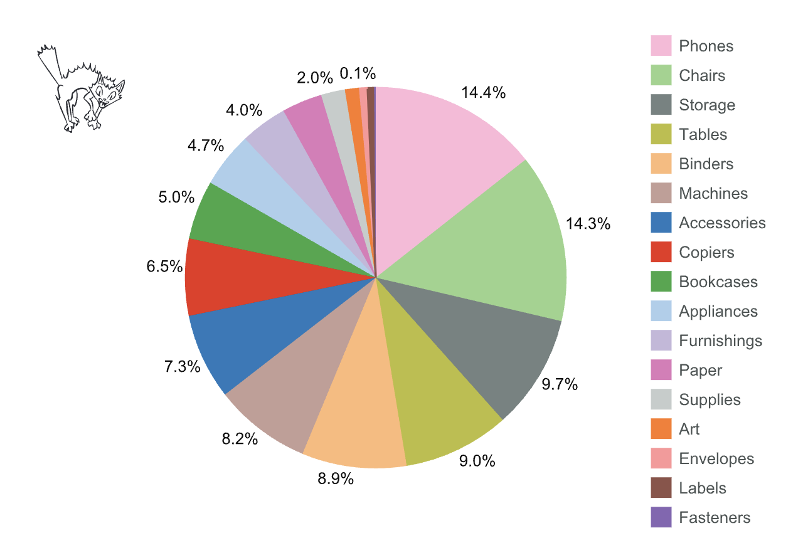
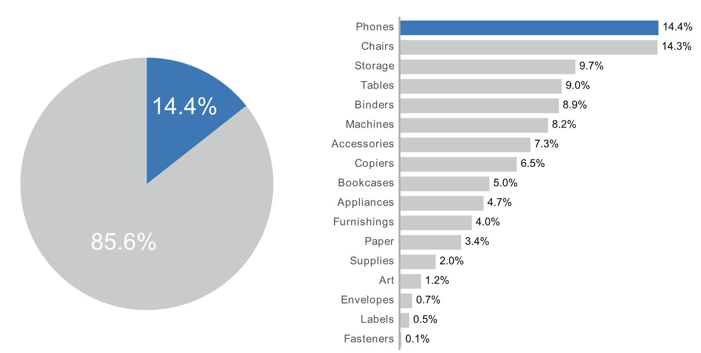
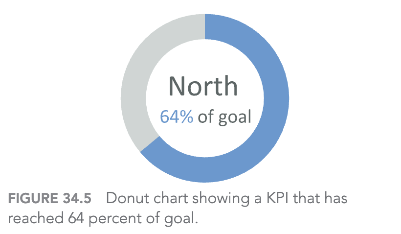
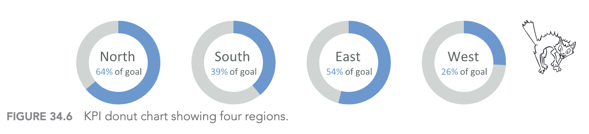
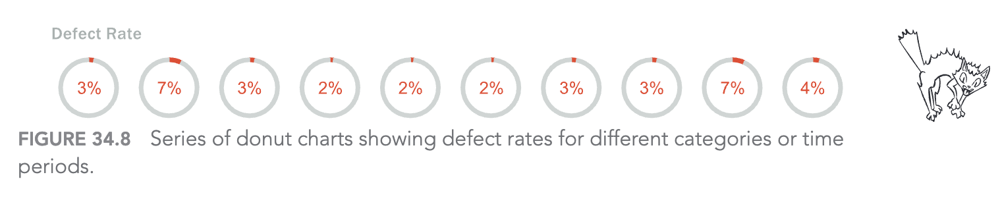
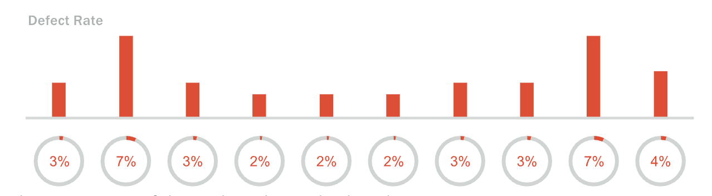
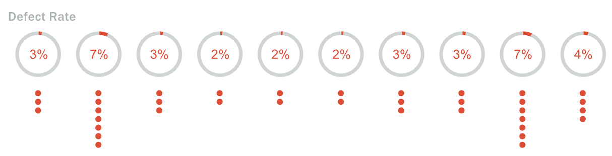

# Sự cám dỗ của biểu đồ tròn và donut

Chapter 34: The Allure of Pies and Donuts

- Chủ đề: khi nào pie/donut chart có thể dùng được
- Trọng tâm: so sánh định lượng và các phương án thỏa hiệp
- Thông điệp chính: nếu buộc phải dùng biểu đồ tròn, hãy bổ sung cách mã hóa dễ đọc hơn

<!--
Speaker notes:
Mở đầu bằng cách nói rằng chương này không phủ nhận hoàn toàn pie chart hay donut chart.
Điểm chính là chúng thường hấp dẫn về mặt thị giác, nhưng lại yếu khi người xem cần so sánh chính xác.
Bài trình bày sẽ đi qua các trường hợp có thể chấp nhận được, các tình huống dễ sai, và cách xử lý khi khách hàng hoặc sếp vẫn yêu cầu dùng biểu đồ tròn.
-->

---

## Vấn đề cốt lõi

Pie chart và donut chart thường gây khó vì người xem phải so sánh:

- **Góc** của các lát cắt
- **Cung** trên đường tròn
- **Diện tích** hoặc kích thước hình tròn
- Nhiều màu và nhiều nhãn cùng lúc

**Nguyên tắc cần nhớ:** chiều dài/vị trí thường dễ so sánh hơn góc/cung/diện tích.

<!--
Speaker notes:
Người xem thường cảm thấy pie chart dễ hiểu vì nó quen thuộc và trực quan ở mức tổng quát.
Nhưng khi phải trả lời câu hỏi "phần nào lớn hơn bao nhiêu", não người không giỏi so sánh góc và cung.
Nếu số danh mục tăng lên, vấn đề còn rõ hơn vì người xem phải liên tục nhìn qua lại giữa lát cắt, màu sắc và chú giải.
Đây là nền tảng của toàn bộ chương.
Bar chart hiệu quả vì các cột bắt đầu từ cùng một baseline, nên mắt người dễ so sánh chiều dài.
Dot plot hiệu quả vì người xem so sánh vị trí các điểm trên cùng một trục.
Pie và donut dùng góc, cung hoặc diện tích, nên phù hợp hơn cho cảm nhận tổng quan chứ không phù hợp cho so sánh chính xác.
-->

---

## Ngoại lệ 1: pie chart trên bản đồ

Hình 34.1: Pie chart trên bản đồ thể hiện khiếu nại đã đóng và đang mở.

<!--
Speaker notes:
Đây là một ngoại lệ hợp lý.
Khi dữ liệu gắn với địa lý, ta cần giữ vị trí của từng bang hoặc khu vực trên bản đồ.
Nếu đặt nhiều bar chart nhỏ lên bản đồ, người xem không có một baseline chung để so sánh và bố cục có thể rất rối.
Trong trường hợp này, pie chart giúp thể hiện part-to-whole tại từng vị trí địa lý, miễn là số phần trong mỗi pie rất ít.
-->

---

## Ngoại lệ 2: kích thước hình tròn là mã hóa phụ

Hình 34.2: Scatterplot so sánh tuổi thọ và tỷ lệ sinh; kích thước hình tròn biểu thị dân số.

<!--
Speaker notes:
Trong scatterplot này, mục tiêu chính không phải là so sánh dân số.
Mục tiêu chính là xem mối quan hệ giữa fertility rate và life expectancy.
Vị trí của điểm mới là mã hóa chính, còn kích thước hình tròn chỉ thêm bối cảnh.
Vì vậy việc dùng size ở đây chấp nhận được: nó giúp người xem nhận ra các quốc gia đông dân như Trung Quốc và Ấn Độ, nhưng không bắt người xem phải so sánh dân số thật chính xác.
-->

---

## Khi khách hàng muốn pie chart nhiều danh mục

<ul>
  <li>17 danh mục doanh thu</li>
  <li>Mỗi danh mục một màu</li>
  <li>Phải đọc qua lại giữa lát cắt và legend</li>
  <li>Khó thấy chênh lệch nhỏ giữa các nhóm</li>
</ul>

<!--
Speaker notes:
Đây là ví dụ điển hình của pie chart bị dùng quá tải.
Về mặt ý tưởng, biểu đồ vẫn thể hiện part-to-whole, nhưng số lát cắt quá nhiều khiến người xem không thể so sánh hiệu quả.
Ngay cả khi các lát cắt đã được sắp xếp, người xem vẫn phải dựa vào màu và chú giải.
Điểm cần nhấn mạnh là: biểu đồ này đáp ứng yêu cầu "có pie chart", nhưng không đáp ứng tốt yêu cầu "giúp người xem hiểu dữ liệu".
-->

---

## Thỏa hiệp tốt hơn: pie chart + bar chart

- Chỉ highlight **một lát cắt quan trọng**
- Gom phần còn lại thành màu xám
- Thêm bar chart để so sánh chính xác
- Vẫn giữ pie chart theo yêu cầu của stakeholder

<!--
Speaker notes:
Đây là cách xử lý thực dụng khi không thể loại bỏ pie chart.
Pie chart vẫn có mặt, nhưng nó không còn gánh toàn bộ nhiệm vụ truyền đạt thông tin.
Bar chart đảm nhận phần so sánh chính xác, vì nó dùng chiều dài từ baseline chung.
Cách này cũng giảm tải màu sắc: chỉ còn một màu nhấn và một màu nền, nên người xem tập trung vào danh mục quan trọng.
-->

---

## Donut chart làm KPI đơn

<ul>
  <li>Phù hợp hơn khi chỉ có <strong>một giá trị</strong></li>
  <li>Không yêu cầu so sánh nhiều danh mục</li>
  <li>Dễ hiểu nếu mục tiêu có giới hạn trên là 100%</li>
  <li>Ví dụ: North đạt 64% mục tiêu</li>
</ul>

<!--
Speaker notes:
Donut chart KPI đơn dễ đọc hơn pie chart nhiều danh mục vì người xem chỉ cần hiểu một con số.
Ở đây không có nhiệm vụ so sánh lát này với lát khác.
Tuy vậy vẫn cần chú ý: donut chart KPI hợp lý nhất khi mục tiêu có trần tự nhiên là 100%.
Nếu chỉ số có thể vượt 100%, ví dụ doanh số đạt 106% hoặc 110% mục tiêu, donut chart bắt đầu khó diễn giải.
-->

---

## Donut chart yếu khi phải so sánh nhiều vùng

- North, East, South, West đều có donut riêng
- Người xem dễ phải dựa vào nhãn số bên trong
- Khó so sánh nhanh các mức gần nhau
- Nếu vượt 100%, donut chart càng khó thể hiện

<!--
Speaker notes:
Khi có bốn donut chart, vấn đề so sánh quay trở lại.
Người xem phải nhìn từng vòng, ước lượng phần cung đã hoàn thành, rồi so sánh giữa các vùng.
Thực tế phần lớn người xem sẽ đọc số ở giữa thay vì đọc hình dạng.
Nếu biểu đồ chỉ hoạt động nhờ nhãn số, đó là dấu hiệu chart type không thật sự hỗ trợ tốt nhiệm vụ phân tích.
-->

---

## Khi stakeholder vẫn muốn "nhiều donut"

Hình 34.8: Chuỗi donut chart thể hiện defect rate theo danh mục hoặc thời gian.

<!--
Speaker notes:
Ví dụ này mô phỏng tình huống rất thực tế: dù đã giải thích, stakeholder vẫn muốn nhiều donut chart vì cảm thấy chúng có tác động thị giác hơn.
Vấn đề là tất cả giá trị đều nhỏ, như 2%, 3%, 4%, 7%.
Các lát đỏ trên donut rất mỏng, nên sự khác biệt giữa 2% và 3% gần như không thể thấy rõ bằng mắt.
Đây là lúc cần một phương án bổ sung thay vì chỉ tranh luận bỏ donut.
-->

---

## Bổ sung bar chart để cứu khả năng so sánh

- Donut vẫn đáp ứng yêu cầu hình thức
- Bar chart phía trên tạo baseline chung
- Chênh lệch nhỏ như **2% và 3%** dễ thấy hơn
- Mắt người đọc phần bar trước, donut trở thành ngữ cảnh phụ

<!--
Speaker notes:
Đây là một thỏa hiệp mạnh hơn.
Ta không loại bỏ donut chart ngay, nhưng thêm bar chart để thông tin chính được mã hóa bằng chiều dài.
Người xem có thể thấy ngay cột nào cao hơn, thấp hơn, và mức chênh lệch tương đối.
Trong bài trình bày, nên nhấn mạnh rằng phần làm cho chart dễ đọc không phải donut, mà là các bar ở phía trên.
-->

---

## Hoặc dùng dot plot để thể hiện từng phần trăm

- Mỗi chấm đại diện cho **1% defect**
- Số lượng chấm giúp so sánh trực tiếp
- Dễ nhận ra nhóm 7% nhiều hơn nhóm 3%
- Phù hợp khi giá trị nhỏ và rời rạc

<!--
Speaker notes:
Dot plot là một cách bổ sung khác.
Thay vì bắt người xem đọc những lát donut rất mỏng, ta biểu diễn mỗi phần trăm bằng một chấm.
Khi đó sự khác biệt giữa 2, 3, 4 hoặc 7 phần trăm trở nên trực quan hơn.
Cách này vẫn giữ donut nếu stakeholder muốn, nhưng phần dot mới là phần giúp so sánh tốt hơn.
-->

---

## Kết luận

### 3 bài học chính

1. Pie/donut chart chỉ nên dùng cẩn trọng, nhất là khi cần **so sánh chính xác**
2. Nếu buộc phải dùng, hãy giảm số lát cắt và dùng màu nhấn có chủ đích
3. Bổ sung **bar chart** hoặc **dot plot** để người xem đọc dữ liệu tốt hơn

Q&A

<!--
Speaker notes:
Kết bài bằng thông điệp thực tế: không phải lúc nào người thiết kế cũng có toàn quyền chọn chart type tốt nhất.
Khi bị buộc phải dùng pie hoặc donut, mục tiêu là giảm thiệt hại bằng cách thêm các mã hóa tốt hơn.
Nếu stakeholder dần nhận ra chính bar chart hoặc dot plot giúp họ hiểu dữ liệu, đó là cơ hội để loại bỏ pie/donut ở phiên bản sau.
Có thể mở câu hỏi thảo luận: Trong dashboard thật, khi nào chúng ta nên thỏa hiệp và khi nào nên phản biện mạnh hơn?
-->
