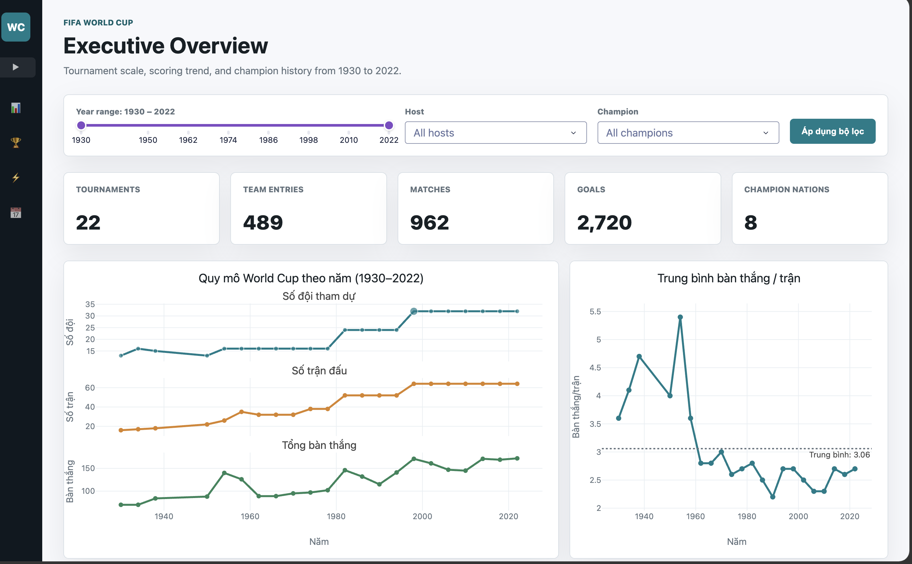
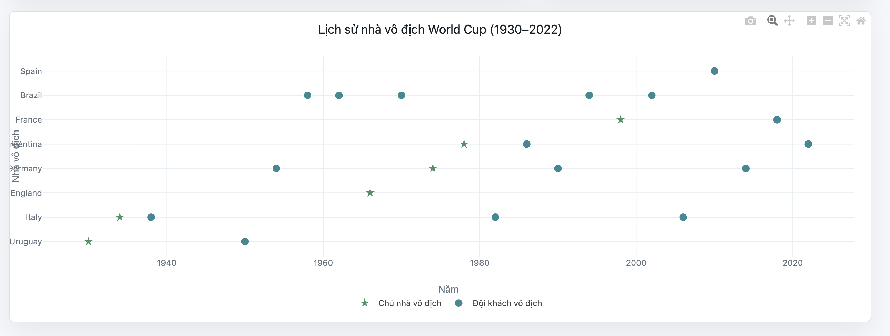
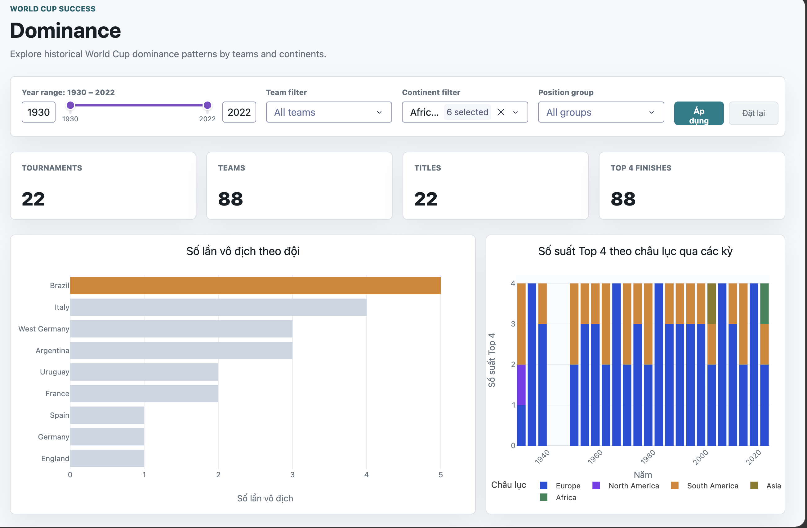
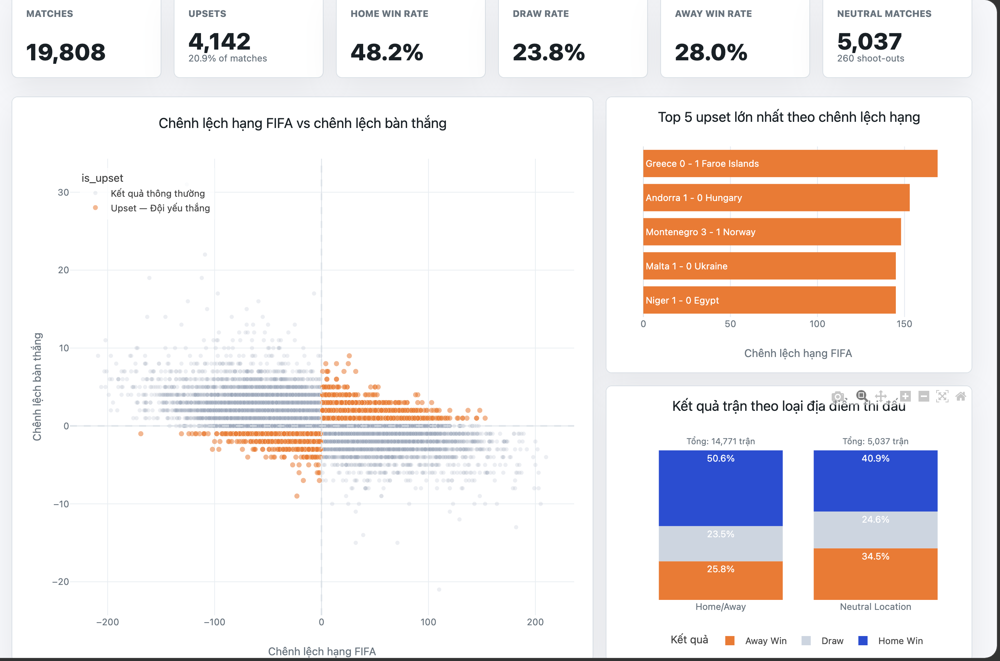
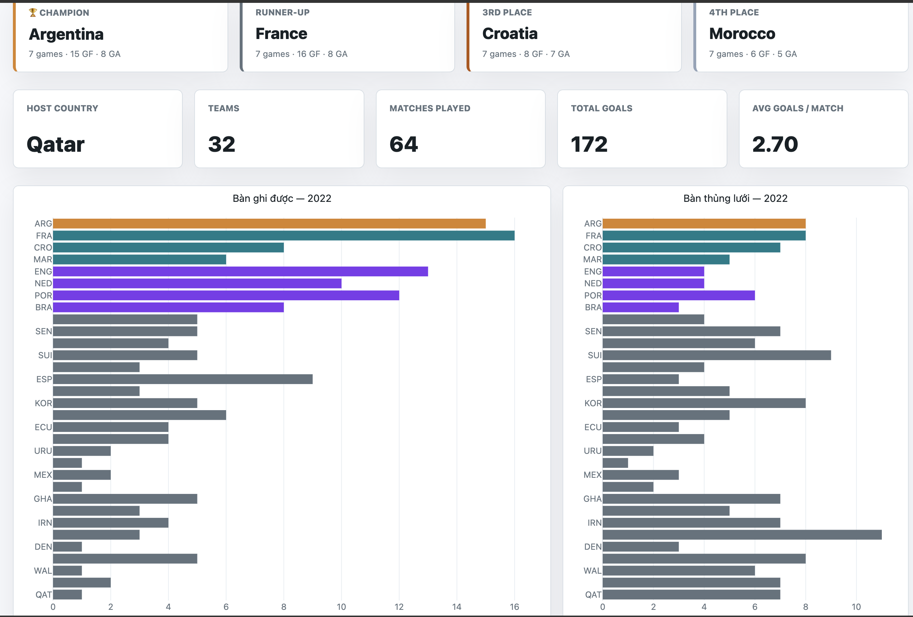
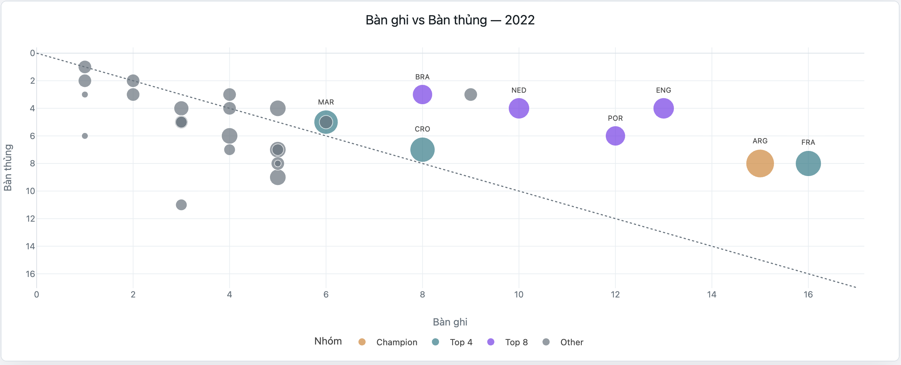

# FIFA World Cup Dashboard Report

**Chủ đề:** FIFA World Cup Dashboard — Tăng trưởng, Thống trị và Bất ngờ  
**Môn học:** Data Visualization  
**Nhóm:** 2  
**Công cụ:** Dash · Plotly · Pandas

---

## 1. Giới thiệu (Introduction)

### 1.1. Bối cảnh

FIFA World Cup là giải đấu bóng đá lớn nhất hành tinh, được tổ chức lần đầu tiên vào năm 1930 tại Uruguay với sự tham gia của 13 đội tuyển. Trải qua gần một thế kỷ phát triển, giải đấu đã mở rộng lên 32 đội (từ năm 1998) với hàng tỷ khán giả theo dõi trên toàn cầu. Sự mở rộng về quy mô tổ chức, số lượng đội tuyển tham dự và mức độ phủ sóng truyền thông đặt ra một câu hỏi thú vị cho phân tích dữ liệu: liệu sự tăng trưởng này có đi kèm với sự phân tán quyền lực và tính cạnh tranh thực sự, hay bóng đá đỉnh cao vẫn là sân chơi của một nhóm nhỏ đội tuyển ưu tú?

Với lượng dữ liệu lịch sử phong phú từ 22 kỳ World Cup (1930–2022) và gần 24.000 trận đấu quốc tế có bảng xếp hạng FIFA, đây là một bài toán phù hợp để áp dụng các kỹ thuật trực quan hóa dữ liệu nhằm khám phá xu hướng, so sánh thành tích và phát hiện các mẫu hình (patterns) ẩn sau những con số.

### 1.2. Mục tiêu dashboard

Dashboard được thiết kế với ba mục tiêu chính:

1. **Khám phá xu hướng tăng trưởng** của World Cup qua thời gian về quy mô tổ chức, số đội tham dự, số trận đấu và hiệu suất ghi bàn.
2. **Phân tích mức độ tập trung quyền lực** trong lịch sử giải đấu — xác định những đội tuyển và khu vực địa lý nào thống trị danh hiệu vô địch và các vị trí cao.
3. **Đánh giá tính cạnh tranh thực tế** ở cấp độ từng trận đấu — kiểm tra mối quan hệ giữa bảng xếp hạng FIFA và kết quả trận đấu, đồng thời phát hiện các trận đấu bất ngờ (upsets).

### 1.3. Câu hỏi phân tích chính

> **World Cup đã thật sự trở thành một giải đấu toàn cầu hơn, hay chức vô địch vẫn nằm trong tay một nhóm đội tuyển elite?**

Câu hỏi trung tâm này được phân tách thành ba câu hỏi phụ:

- **Q1 — Expansion:** Quy mô World Cup đã thay đổi như thế nào qua thời gian về số đội, số trận, tổng bàn thắng và bàn thắng trung bình mỗi trận?
- **Q2 — Dominance:** Đội tuyển và khu vực địa lý nào kiểm soát lịch sử giải đấu? Sự phân bổ danh hiệu có trở nên đa dạng hơn hay vẫn tập trung?
- **Q3 — Competitiveness:** Ở cấp độ từng trận, bảng xếp hạng FIFA có dự đoán chính xác kết quả không? Mức độ bất ngờ (upset) trong các trận đấu quốc tế là bao nhiêu?

### 1.4. Phạm vi phân tích

- **Dữ liệu World Cup:** Toàn bộ 22 kỳ World Cup từ 1930 đến 2022, bao gồm thông tin tổng quan giải đấu và bảng xếp hạng chi tiết từng đội tuyển.
- **Dữ liệu trận đấu quốc tế:** 23.921 trận đấu quốc tế từ 1993 đến 2022, bao gồm bảng xếp hạng FIFA, tỷ số, giải đấu và thông tin sân trung lập.
- **Case study:** World Cup 2022 tại Qatar được sử dụng làm ví dụ phân tích chi tiết.

---

## 2. Mô tả dữ liệu (Dataset Description)

### 2.1. Nguồn dữ liệu

Dashboard sử dụng dữ liệu từ hai bộ dataset trên nền tảng Kaggle:

1. **FIFA Football World Cup Dataset** — tác giả Sourav Banerjee  
   URL: https://www.kaggle.com/datasets/iamsouravbanerjee/fifa-football-world-cup-dataset/data  
   Bao gồm file tổng quan lịch sử các kỳ World Cup và 22 file bảng xếp hạng chi tiết theo từng năm tổ chức.

2. **FIFA World Cup 2022 Dataset** — tác giả Brenda  
   URL: https://www.kaggle.com/datasets/brenda89/fifa-world-cup-2022/data  
   Cung cấp dữ liệu trận đấu quốc tế từ 1993 đến 2022 kèm bảng xếp hạng FIFA.

### 2.2. Tổng quan các file dữ liệu

Bảng 1 trình bày tổng quan các file dữ liệu được sử dụng trong dashboard.

**Bảng 1.** Tổng quan các file dữ liệu

| File dữ liệu | Số dòng | Số cột | Mô tả |
|---|:---:|:---:|---|
| `FIFA - World Cup Summary.csv` | 22 | 10 | Thông tin tổng quan từng kỳ World Cup: năm, nước chủ nhà, nhà vô địch, á quân, hạng ba, hạng tư, số đội, số trận, tổng bàn thắng, bàn thắng trung bình/trận. |
| `FIFA - {YYYY}.csv` (22 files) | Tổng 454 | 7 | Bảng xếp hạng chi tiết từng đội tuyển trong từng kỳ: vị trí, tên đội, số trận, bàn ghi, bàn thủng, hiệu số, điểm. |
| `international_matches.csv` | 23.921 | 17 | Kết quả trận đấu quốc tế 1993–2022: ngày, đội nhà/khách, tỷ số, giải đấu, thành phố, nước, sân trung lập, bảng xếp hạng FIFA, điểm FIFA, tỷ số luân lưu, kết quả. |

### 2.3. Các biến chính theo nhóm

Bảng 2 phân loại các biến quan trọng theo loại dữ liệu.

**Bảng 2.** Phân loại biến dữ liệu

| Loại biến | Biến | Nguồn |
|---|---|---|
| **Nominal** | `host`, `champion`, `runner_up`, `third_place`, `fourth_place`, `home_team`, `away_team`, `tournament`, `city`, `country` | Summary, Matches |
| **Ordinal** | `position` (1–32), `position_group` (Champion / Top 4 / Top 8 / Other), `home_team_result` (Win / Draw / Lose) | Standings, Derived |
| **Quantitative (ratio)** | `teams`, `matches_played`, `goals_scored`, `avg_goals_per_game`, `goals_for`, `goals_against`, `goal_difference`, `points`, `home_team_score`, `away_team_score`, `home_team_fifa_rank`, `away_team_fifa_rank` | Summary, Standings, Matches |
| **Quantitative (derived)** | `rank_gap`, `home_goal_diff`, `upset_rank_gap`, `goals_per_appearance` | Derived |
| **Boolean** | `neutral_location`, `host_won`, `is_upset` | Matches, Derived |
| **Temporal** | `year`, `date` | Summary, Matches |

### 2.4. Tiền xử lý dữ liệu

Quá trình tiền xử lý dữ liệu được thực hiện trong module `src/data.py` và bên trong từng page module. Các bước chính bao gồm:

#### 2.4.1. Chuẩn hóa tên cột

Tất cả các cột được chuyển về dạng snake_case (viết thường, thay dấu cách và gạch ngang bằng gạch dưới) thông qua hàm `_snake_case_columns()`. Ví dụ: `"Matches Played"` → `"matches_played"`, `"Goals For"` → `"goals_for"`.

#### 2.4.2. Chuẩn hóa tên đội tuyển

Một số tên đội tuyển lịch sử được chuẩn hóa về tên hiện đại để đảm bảo tính nhất quán khi phân tích liên kỳ. Cụ thể, `"West Germany"` được ánh xạ thành `"Germany"` thông qua hàm `normalize_team_name()` và từ điển `TEAM_NORMALIZATION`.

#### 2.4.3. Ghép nối dữ liệu standings

22 file standings riêng biệt (mỗi file tương ứng một kỳ World Cup) được đọc và ghép nối (concatenate) thành một DataFrame duy nhất gồm 454 dòng. Mỗi dòng được gắn thêm cột `year` tương ứng, trích xuất từ tên file (ví dụ: `"FIFA - 2022.csv"` → `year = 2022`).

#### 2.4.4. Ánh xạ khu vực địa lý (continent)

Trong module `pages/dominance.py`, một hàm ánh xạ tự động (`_load_team_continent_mapping()`) được xây dựng bằng cách đọc file `international_matches.csv` và xác định châu lục phổ biến nhất (mode) cho mỗi đội tuyển. Đối với các đội tuyển lịch sử không có trong dữ liệu trận đấu hiện đại, một từ điển dự phòng (`FALLBACK_TEAM_CONTINENT`) được sử dụng.

#### 2.4.5. Các biến phái sinh (derived fields)

Bảng 3 liệt kê tất cả các biến được tạo thêm trong quá trình xử lý dữ liệu, kèm công thức hoặc logic tính toán.

**Bảng 3.** Các biến phái sinh

| Biến | Công thức / Logic | Module |
|---|---|---|
| `champion_norm` | `normalize_team_name(champion)` — ánh xạ "West Germany" → "Germany" | `data.py` |
| `runner_up_norm` | `normalize_team_name(runner_up)` | `data.py` |
| `third_place_norm` | `normalize_team_name(third_place)` | `data.py` |
| `host_norm` | `normalize_team_name(host)` | `data.py` |
| `host_won` | `host_norm == champion_norm` (boolean) | `data.py` |
| `team_norm` | `normalize_team_name(team)` | `data.py` |
| `position_group` | `pd.cut(position, bins=[0,1,4,8,∞], labels=["Champion","Top 4","Top 8","Other"])` | `data.py` |
| `year` (matches) | `date.dt.year` | `data.py` |
| `home_team_norm` | `normalize_team_name(home_team)` | `data.py` |
| `away_team_norm` | `normalize_team_name(away_team)` | `data.py` |
| `home_goal_diff` | `home_team_score - away_team_score` | `data.py` |
| `rank_gap` | `home_team_fifa_rank - away_team_fifa_rank` | `data.py` |
| `winner` | `"Draw"` nếu hòa; tên đội thắng nếu có kết quả | `data.py` |
| `winner_rank` | Thứ hạng FIFA của đội thắng | `data.py` |
| `loser_rank` | Thứ hạng FIFA của đội thua | `data.py` |
| `is_upset` | `(winner ≠ "Draw") AND (winner_rank > loser_rank)` — đội thắng có thứ hạng kém hơn | `data.py` |
| `upset_rank_gap` | `winner_rank - loser_rank` (chỉ khi `is_upset = True`) | `data.py` |
| `date_str` | `date.strftime("%Y-%m-%d")` | `data.py` |
| `match_short_label` | `"HomeTeam X - Y AwayTeam"` (chuỗi mô tả ngắn trận đấu) | `data.py` |
| `continent` | Ánh xạ tên đội → châu lục qua mode analysis hoặc fallback dict | `dominance.py` |
| `goals_per_appearance` | `total_goals_for / appearances` (tính cho mỗi đội qua tổng hợp) | `dominance.py` |

### 2.5. Kiểm tra giá trị thiếu (missing values)

Bảng 4 trình bày kết quả kiểm tra giá trị thiếu cho từng dataset.

**Bảng 4.** Giá trị thiếu trong dữ liệu

| Dataset | Biến có missing | Số dòng thiếu | Ghi chú |
|---|---|:---:|---|
| World Cup Summary | (không có) | 0 | Dữ liệu đầy đủ cho cả 22 kỳ. |
| Standings (22 files) | (không có) | 0 | Dữ liệu đầy đủ cho tất cả 454 dòng. |
| International Matches | `city` | 3 | Có thể bỏ qua, không ảnh hưởng phân tích. |
| | `home_team_fifa_rank` | 276 | Một số trận đấu đầu giai đoạn 1993 chưa có bảng xếp hạng FIFA. Các trận này bị loại khi phân tích upset. |
| | `away_team_fifa_rank` | 276 | Tương tự `home_team_fifa_rank`. |
| | `home_team_total_fifa_points` | 276 | Tương tự. |
| | `away_team_total_fifa_points` | 276 | Tương tự. |
| | `home_team_score_penalty` | 22.932 | Chỉ có giá trị khi trận đấu diễn ra đá luân lưu (96% trận không có). Đây là đặc điểm tự nhiên của dữ liệu, không phải lỗi. |
| | `away_team_score_penalty` | 22.932 | Tương tự. |

### 2.6. Hạn chế dữ liệu

- **Phạm vi thời gian không đồng nhất:** Dữ liệu World Cup bao phủ 1930–2022 (gần 100 năm), trong khi dữ liệu trận đấu quốc tế chỉ từ 1993–2022 (30 năm). Do đó, phân tích upset và ranking chỉ áp dụng được cho giai đoạn hiện đại.
- **Thiếu bảng xếp hạng FIFA trước 1993:** Bảng xếp hạng FIFA chính thức bắt đầu từ 1993, nên không thể đánh giá tính bất ngờ (upset) cho các trận đấu trước giai đoạn này.
- **Chuẩn hóa tên đội hạn chế:** Hiện tại chỉ ánh xạ `"West Germany"` → `"Germany"`. Một số trường hợp khác như `"Soviet Union"` → `"Russia"`, `"Czechoslovakia"` → `"Czech Republic"` chưa được xử lý, có thể ảnh hưởng nhẹ đến phân tích liên kỳ.
- **Không có dữ liệu bản đồ địa lý:** Dataset không bao gồm tọa độ (latitude/longitude) hoặc mã quốc gia chuẩn ISO, nên không hỗ trợ trực tiếp cho việc tạo bản đồ (map visualization).

---

## 3. Thiết kế Dashboard (Dashboard Design)

### 3.1. Công nghệ sử dụng

Dashboard được xây dựng trên nền tảng web application sử dụng bộ công cụ Python sau:

- **Dash** (Plotly Dash): Framework ứng dụng web tương tác, cho phép xây dựng giao diện bằng Python với mô hình callback reactive.
- **Plotly**: Thư viện trực quan hóa tương tác, hỗ trợ nhiều loại biểu đồ (line, bar, scatter) với khả năng hover, zoom, và click.
- **Pandas**: Thư viện xử lý và phân tích dữ liệu dạng bảng, sử dụng cho đọc CSV, lọc, nhóm và tính toán thống kê.
- **CSS tùy chỉnh**: File `assets/styles.css` với hệ thống CSS variables và responsive design hỗ trợ nhiều kích thước màn hình.

Toàn bộ hệ thống visual được thống nhất qua một Plotly template tùy chỉnh có tên `"worldcup"` (đăng ký trong `src/theme.py`), đảm bảo tính nhất quán về font (Inter), bảng màu, grid styling, và legend positioning trên tất cả các biểu đồ.

### 3.2. Cấu trúc multi-page dashboard

Ứng dụng được tổ chức dưới dạng **multi-page dashboard** với một sidebar navigation cố định bên trái (có thể thu gọn) và vùng nội dung chính bên phải. Điều hướng giữa các trang sử dụng `dcc.Location` và callback routing. Dashboard gồm 4 trang chính:

| Trang | Đường dẫn | Biểu tượng | Mục đích |
|---|---|:---:|---|
| Executive Overview | `/` | 📊 | Xu hướng tăng trưởng quy mô World Cup |
| Dominance | `/dominance` | 🏆 | Phân tích sự thống trị và di sản |
| Upsets & Competitiveness | `/upsets` | ⚡ | Tính cạnh tranh và các trận bất ngờ |
| Tournament Detail | `/tournament` | 📅 | Chi tiết từng kỳ World Cup cụ thể |

### 3.3. Mạch kể chuyện (Storytelling Flow)

Dashboard không chỉ là tập hợp các biểu đồ rời rạc, mà được tổ chức theo một **narrative structure** (mạch kể chuyện) dẫn dắt người xem đi từ bức tranh tổng quan đến phân tích chi tiết:

```
Overview (Expansion)  →  Dominance (Concentration)  →  Upsets (Surprises)  →  Tournament Detail (Case Study)
```

- **Act 1 — Expansion:** World Cup ngày càng lớn hơn về quy mô.
- **Act 2 — Dominance:** Lớn hơn không đồng nghĩa với cân bằng — danh hiệu vẫn tập trung.
- **Act 3 — Upsets:** Tuy nhiên, ở cấp độ từng trận, bóng đá vẫn đầy bất ngờ.
- **Act 4 — Case Study 2022:** Minh họa tất cả qua World Cup 2022.

Mạch truyện này kết hợp phương pháp **guided storytelling** (dẫn dắt qua sidebar navigation và thứ tự các trang) với **free exploration** (người dùng có thể tự lọc, nhấp vào biểu đồ và khám phá theo ý muốn).

### 3.4. Executive Overview

**Mục tiêu:** Trả lời Q1 — World Cup đã thay đổi quy mô như thế nào qua gần một thế kỷ?



*Hình 1. Trang Executive Overview — KPI cards và biểu đồ xu hướng quy mô.*

#### Thành phần giao diện

**5 KPI Cards** (hàng trên cùng):
- Tournaments: tổng số kỳ World Cup trong phạm vi lọc.
- Team entries: tổng lượt tham dự của tất cả đội tuyển.
- Matches: tổng số trận đấu.
- Goals: tổng số bàn thắng.
- Champion nations: số đội tuyển khác nhau từng vô địch.

**Bộ lọc (filter bar):**
- Year range slider (RangeSlider): cho phép chọn khoảng thời gian phân tích.
- Host dropdown (multi-select): lọc theo nước chủ nhà.
- Champion dropdown (multi-select): lọc theo đội vô địch.
- Nút Apply: áp dụng bộ lọc.

**Biểu đồ chính:**

1. **Tournament Scale** — 3 biểu đồ đường xếp chồng theo trục dọc (subplots chia sẻ trục X) hiển thị xu hướng theo năm của ba chỉ số: số đội tham dự (`teams`), số trận đấu (`matches_played`), và tổng bàn thắng (`goals_scored`). Sử dụng `go.Scatter` với `mode="lines+markers"`. Mỗi biểu đồ có đường tham chiếu (hline) tại giá trị trung bình tổng thể. Ba annotation mũi tên đánh dấu các mốc lịch sử quan trọng: 1950 ("Trở lại sau WWII"), 1982 ("Mở rộng 24 đội"), 1998 ("Mở rộng 32 đội").

2. **Average Goals per Game** — Biểu đồ đường đơn hiển thị bàn thắng trung bình mỗi trận theo năm. Có đường tham chiếu ngang (dashed, màu đỏ) tại giá trị trung bình toàn kỳ, kèm annotation ghi chú điểm cực đại.



*Hình 2. Trang Executive Overview — Champion Timeline.*

3. **Champion Timeline** — Biểu đồ chấm (dot plot) với trục X là năm, trục Y là tên đội vô địch. Sử dụng 2 trace phân biệt bằng marker: ngôi sao (★) cho kỳ mà nước chủ nhà vô địch (`host_won = True`), hình tròn (●) cho các kỳ còn lại. Cho phép nhận diện nhanh mẫu hình lặp lại của nhóm đội tuyển chiến thắng.

#### Insight chính

Từ các biểu đồ trên trang Overview, người xem có thể nhận ra:
- Quy mô World Cup tăng trưởng rõ rệt qua thời gian: từ 13 đội và 18 trận năm 1930 lên 32 đội và 64 trận từ năm 1998.
- Tổng bàn thắng tăng theo quy mô giải đấu, nhưng bàn thắng trung bình mỗi trận không tăng tương ứng — thậm chí giảm từ đỉnh cao >5 bàn/trận ở thập niên 1950 xuống khoảng 2.5–2.7 bàn/trận ở thời kỳ hiện đại.
- Champion Timeline cho thấy một số đội tuyển xuất hiện nhiều lần (Brazil 5 lần, Germany 4 lần, Italy 4 lần), gợi ý sự tập trung quyền lực — chủ đề sẽ được phân tích sâu hơn ở trang Dominance.

### 3.5. Dominance

**Mục tiêu:** Trả lời Q2 — Đội tuyển và khu vực nào thống trị lịch sử World Cup?



*Hình 3. Trang Dominance — Biểu đồ vô địch, phân bổ Top 4 theo châu lục, và biểu đồ tổng bàn thắng.*

#### Thành phần giao diện

**4 KPI Cards:**
- Tournaments: số kỳ World Cup trong phạm vi lọc.
- Teams: số đội tuyển khác nhau.
- Titles: tổng số lần vô địch (có thể bằng số kỳ nếu không lọc).
- Top 4 Finishes: tổng số lượt lọt vào Top 4.

**Bộ lọc (filter bar):**
- Year range slider (step=4, tương ứng chu kỳ World Cup).
- Team dropdown (multi-select): lọc theo đội tuyển cụ thể.
- Continent dropdown (multi-select): lọc theo châu lục.
- Position group dropdown (multi-select): lọc theo nhóm thành tích (Champion, Top 4, Top 8, Other).
- Nút Apply và Reset.

**Biểu đồ chính:**

1. **Championship Count** — Biểu đồ thanh ngang (`px.bar`, horizontal) hiển thị top 20 đội tuyển theo số lần vô địch. Đội có nhiều danh hiệu nhất được tô màu amber (`accent_2`), các đội khác dùng màu xám nhẹ, tạo hiệu ứng pre-attentive attention hướng ánh nhìn vào nhà vô địch nhiều nhất.

2. **Top 4 by Continent** — Biểu đồ thanh xếp chồng theo chiều dọc (`px.bar`, stacked). Trục X là năm tổ chức, trục Y là số lượt Top 4, màu sắc phân chia theo châu lục. Các dải `vrect` phủ nhẹ đánh dấu từng giai đoạn thay đổi thể thức giải đấu. Biểu đồ cho thấy trực quan sự áp đảo gần như tuyệt đối của Europe và South America trong nhóm dẫn đầu.

3. **Total Goals — Top 20** — Biểu đồ thanh ngang hiển thị tổng bàn thắng tích lũy của top 20 đội tuyển, kèm thông tin số lần tham dự và hiệu suất bàn thắng/lần tham dự qua `custom_data` và hover.

**Bảng tổng hợp (DataTable):**

Bảng dữ liệu tương tác cho phép sắp xếp và phân trang (15 dòng/trang), hiển thị: Team, Continent, Appearances, Championships, Top 4, Best Position, Goals For, Points. Các dòng có vị trí Champion (Position=1) được tô nổi bật bằng màu accent.

#### Insight chính

- Chỉ có 9 đội tuyển từng vô địch World Cup trong 22 kỳ tổ chức, cho thấy quyền lực vô địch cực kỳ tập trung.
- Brazil dẫn đầu với 5 lần vô địch, tiếp theo là Germany và Italy (4 lần mỗi đội).
- Biểu đồ Top 4 by Continent chứng minh rằng Europe và South America chiếm gần như toàn bộ các vị trí Top 4 trong lịch sử, với rất ít ngoại lệ (Hàn Quốc 2002, Morocco 2022).

### 3.6. Upsets & Competitiveness

**Mục tiêu:** Trả lời Q3 — Bảng xếp hạng FIFA có phản ánh chính xác kết quả trận đấu?



*Hình 4. Trang Upsets & Competitiveness — Scatter plot rank gap vs goal difference, top 5 upsets, phân bố kết quả theo sân trung lập.*

#### Thành phần giao diện

**6 KPI Cards** (được xây dựng động):
- Matches: tổng số trận đấu sau lọc.
- Upsets: số trận bất ngờ kèm tỷ lệ phần trăm.
- Home win rate: tỷ lệ thắng sân nhà.
- Draw rate: tỷ lệ hòa.
- Away win rate: tỷ lệ thắng sân khách.
- Neutral matches: số trận trên sân trung lập kèm số trận đá luân lưu.

**Bộ lọc (filter bar):**
- Year range slider (bước 1 năm, mặc định 2000–max).
- Tournament dropdown (single-select): lọc theo giải đấu (FIFA World Cup, Qualifier, Friendly, v.v.).
- Team dropdown (single-select): lọc theo đội tuyển tham gia.
- Continent dropdown (single-select): lọc theo châu lục.
- Match type dropdown (All / Shootout / Neutral).
- Nút Apply.
- Các dropdown hỗ trợ **cascading filter**: khi thay đổi một bộ lọc, các bộ lọc khác tự động cập nhật danh sách tùy chọn phù hợp.

**Biểu đồ chính:**

1. **Rank Gap vs Goal Difference** — Scatter plot (`px.scatter`) là biểu đồ trung tâm của trang. Trục X biểu thị `rank_gap` (chênh lệch thứ hạng FIFA giữa hai đội), trục Y biểu thị `home_goal_diff` (chênh lệch bàn thắng thực tế). Màu sắc phân biệt trận bình thường (xám) và trận upset (cam/accent). Các đường tham chiếu ngang và dọc tại vị trí 0 chia biểu đồ thành 4 phần tư. Biểu đồ chiếm diện tích lớn (spanning 2 rows) để dễ quan sát phân phối.

2. **Top 5 Upsets** — Biểu đồ thanh ngang hiển thị 5 trận có `upset_rank_gap` lớn nhất (đội cửa dưới thắng với chênh lệch ranking cao nhất). Nhãn text được đặt bên trong thanh.

3. **Result Distribution by Neutral Location** — Biểu đồ thanh xếp chồng theo chiều dọc, so sánh tỷ lệ phần trăm kết quả (Home Win / Away Win / Draw) giữa trận đấu trên sân nhà/sân khách và trận trên sân trung lập. Annotation hiển thị tổng số trận cho mỗi nhóm.

**Bảng chi tiết trận đấu (click-driven):**

Khi người dùng nhấp vào một điểm trên scatter plot hoặc một thanh trên biểu đồ top upsets, một panel chi tiết hiển thị thông tin đầy đủ của trận đấu: ngày, giải đấu, hai đội, tỷ số, thứ hạng FIFA, chênh lệch ranking, và trạng thái upset. Panel sử dụng nền vàng nhạt (`#fff8e1`) với viền vàng để thu hút sự chú ý.

#### Insight chính

- Scatter plot cho thấy mối tương quan yếu giữa chênh lệch ranking và chênh lệch bàn thắng — nhiều trận đấu có khoảng cách ranking lớn nhưng kết quả sát nút hoặc ngược lại.
- Tỷ lệ upset (đội có ranking kém hơn thắng) chiếm một tỷ lệ đáng kể trong tổng số trận đấu, chứng minh rằng bảng xếp hạng FIFA không phải yếu tố quyết định tuyệt đối.
- Lợi thế sân nhà thể hiện rõ: tỷ lệ thắng sân nhà cao hơn đáng kể so với sân trung lập.

### 3.7. Tournament Detail

**Mục tiêu:** Cung cấp giao diện tra cứu chi tiết từng kỳ World Cup, đồng thời dùng World Cup 2022 làm case study minh họa.



*Hình 5. Trang Tournament Detail 2022 — Top 4 highlight cards, biểu đồ Goals For và Goals Against.*

#### Thành phần giao diện

**Bộ lọc:**
- Year dropdown (single-select, không xóa được, mặc định 2022): cho phép chọn bất kỳ kỳ World Cup nào từ 1930 đến 2022.
- Nút Apply.

**Top 4 Rank Cards** (4 cards nổi bật):
- 🏆 Champion: tô màu amber.
- Runner-Up: màu xám.
- 3rd Place: màu nâu.
- 4th Place: màu xám nhạt.
- Mỗi card hiển thị: tên đội, số trận, bàn ghi, bàn thủng.

**5 Meta KPI Cards:**
- Host Country: nước chủ nhà.
- Teams: số đội tham dự.
- Matches Played: tổng số trận.
- Total Goals: tổng bàn thắng.
- Avg Goals/Match: bàn thắng trung bình mỗi trận.

**Biểu đồ chính:**

1. **Goals For** — Biểu đồ thanh ngang (`px.bar`, horizontal) hiển thị bàn ghi của từng đội, sắp xếp theo thứ hạng (vị trí 1 ở trên). Màu sắc phân nhóm theo `position_group` (Champion, Top 4, Top 8, Other). Chiều cao 700px để hiển thị rõ ràng 32 đội.

2. **Goals Against** — Tương tự Goals For, nhưng hiển thị bàn thủng.



*Hình 6. Trang Tournament Detail 2022 — Scatter plot Goals Scored vs Goals Conceded (Bàn ghi vs Bàn thủng).*

3. **Goals Scored vs Goals Conceded** — Bubble chart (`px.scatter` với `size="Points"`): trục X là bàn ghi (Goals For), trục Y là bàn thủng (Goals Against, trục đảo ngược để hướng tốt lên trên). Kích thước bong bóng tỷ lệ với điểm số. Màu sắc phân theo `position_group`. Đường chéo tham chiếu GF=GA giúp phân biệt đội có hiệu số dương/âm. Nhãn text hiển thị cho các đội Top 8.

**Bảng xếp hạng đầy đủ (DataTable):**

Bảng dữ liệu có thể sắp xếp và phân trang (20 dòng/trang), hiển thị: Position, Team, Games Played, Win, Draw, Loss, Goals For, Goals Against, Goal Difference, Points.

**Insight Panel (chỉ hiển thị khi chọn năm 2022):**

Khi chọn World Cup 2022, một panel narrative bổ sung xuất hiện với 4 insight cards phân tích thành tích của Argentina, France, Croatia và Morocco — 4 đội lọt vào Top 4. Mỗi card bao gồm biểu tượng emoji cờ quốc gia và đoạn văn phân tích ngắn.

#### World Cup 2022 — Case Study

World Cup 2022 là kỳ giải minh họa hoàn hảo cho toàn bộ mạch truyện của dashboard:

- **Argentina** vô địch, đại diện cho nhóm elite truyền thống (CONMEBOL) tiếp tục thống trị ngôi cao nhất.
- **France** (á quân) sở hữu chỉ số tấn công nổi bật nhất giải với 16 bàn thắng trong 7 trận, thể hiện rõ trên biểu đồ Goals For.
- **Croatia** (hạng 3) tiếp tục duy trì phong độ ổn định ở vòng cuối, lần thứ hai liên tiếp lọt vào Top 4.
- **Morocco** (hạng 4) là hiện tượng lịch sử — đội bóng châu Phi đầu tiên lọt vào bán kết World Cup, minh chứng cho tính bất ngờ và sự trỗi dậy của các đội tuyển bên ngoài nhóm elite truyền thống.

#### Insight chính

- Bubble chart GF vs GA giúp phân loại rõ ràng phong cách của từng đội: đội thiên về tấn công (nhiều bàn ghi), đội thiên về phòng ngự (ít bàn thủng), và đội cân bằng.
- Thanh bar so sánh song song Goals For và Goals Against cho phép nhận diện nhanh đội có hiệu suất công/thủ tốt nhất.
- Bảng xếp hạng đầy đủ hỗ trợ tra cứu chi tiết từng chỉ số cho tất cả 32 đội.

---

## 4. Phân tích Insight (Insight Analysis)

### 4.1. Sự mở rộng không ngừng của World Cup

Dữ liệu gần một thế kỷ cho thấy World Cup đã trải qua quá trình tăng trưởng vượt bậc về mọi chỉ số quy mô. Giải đấu năm 1930 tại Uruguay chỉ có 13 đội và 18 trận, nhưng tới năm 2022, con số này đã tăng lên 32 đội và 64 trận. Ba mốc mở rộng quan trọng nhất được ghi nhận qua các annotation trên biểu đồ Timeline Scale: sự trở lại sau Thế chiến thứ hai năm 1950 (sau 12 năm gián đoạn), mở rộng lên 24 đội năm 1982, và mở rộng lên 32 đội năm 1998.

Tuy nhiên, sự mở rộng về quy mô không kéo theo sự tăng trưởng tương ứng về hiệu suất ghi bàn. Biểu đồ Average Goals per Game cho thấy chỉ số này đạt đỉnh ở thập niên 1950 (trên 5 bàn/trận tại World Cup 1954 ở Thụy Sĩ) rồi giảm dần và ổn định quanh mốc 2.5–2.7 bàn/trận từ thập niên 1990 trở đi. Điều này phản ánh sự tiến bộ của chiến thuật phòng ngự và mức độ cạnh tranh đồng đều hơn giữa các đội tuyển ở bóng đá hiện đại.

### 4.2. Quyền lực vô địch vẫn cực kỳ tập trung

Dù World Cup mở rộng về quy mô tham dự, câu hỏi liệu quyền lực có phân tán hơn không nhận được một câu trả lời rõ ràng từ trang Dominance: **chưa hẳn**. Trong suốt 22 kỳ World Cup, chỉ có đúng 9 đội tuyển quốc gia từng giành cúp vàng. Brazil dẫn đầu với 5 danh hiệu, tiếp theo là Germany và Italy với 4 danh hiệu mỗi đội. Điều này có nghĩa là chỉ 3 đội tuyển đã chiếm 13/22 (59%) tổng số chức vô địch.

Sự tập trung này còn thể hiện rõ hơn khi phân tích theo khu vực địa lý. Biểu đồ Top 4 by Continent cho thấy Europe và South America chiếm gần như toàn bộ các vị trí Top 4 trong lịch sử giải đấu. Các châu lục khác — Africa, Asia, North America, Oceania — chỉ có những lần xuất hiện rất hiếm hoi trong nhóm dẫn đầu. Biểu đồ thanh xếp chồng qua các năm cho thấy xu hướng này gần như không thay đổi theo thời gian, dù số đội tham dự đã tăng gấp đôi.

### 4.3. Bóng đá vẫn đầy bất ngờ ở cấp độ trận đấu

Nếu chỉ nhìn vào danh hiệu, World Cup có vẻ như bị chi phối hoàn toàn bởi nhóm elite. Tuy nhiên, phân tích ở cấp độ từng trận đấu qua trang Upsets & Competitiveness cho thấy bức tranh phức tạp hơn nhiều. Scatter plot mối quan hệ giữa chênh lệch ranking FIFA và chênh lệch bàn thắng thực tế cho thấy **mối tương quan yếu** — nhiều trận đấu giữa các đội có khoảng cách ranking rất lớn lại kết thúc với tỷ số sít sao, và ngược lại, một số trận giữa các đội xếp hạng gần nhau lại có kết quả chênh lệch lớn.

Tỷ lệ upset (trận mà đội có ranking kém hơn giành chiến thắng) chiếm một phần đáng kể trong tổng số trận đấu quốc tế, khẳng định rằng bảng xếp hạng FIFA chỉ phản ánh xác suất thắng chứ không phải kết quả chắc chắn. Top 5 upsets với chênh lệch ranking cực lớn cho thấy những đội bị đánh giá thấp hoàn toàn có thể tạo nên cú sốc trước những đội hạng cao.

Ngoài ra, phân tích phân bổ kết quả theo tính chất sân cho thấy lợi thế sân nhà là yếu tố có ý nghĩa thống kê: tỷ lệ thắng sân nhà cao hơn rõ rệt so với tỷ lệ thắng trên sân trung lập. Điều này cung cấp thêm một góc nhìn về tính bất ngờ trong bóng đá — kết quả phụ thuộc vào nhiều yếu tố ngoài năng lực thuần túy được phản ánh qua ranking.

### 4.4. World Cup 2022 — Bức tranh thu nhỏ hoàn hảo

World Cup 2022 tại Qatar minh họa trọn vẹn cả ba chủ đề phân tích. Nhóm đội tuyển elite vẫn chiếm vị trí áp đảo: Argentina đăng quang, France giành á quân với lối chơi tấn công hủy diệt (16 bàn thắng, cao nhất giải), và Croatia lần thứ hai liên tiếp lọt vào Top 4 — tất cả đều đến từ Europe hoặc South America.

Tuy nhiên, câu chuyện đáng chú ý nhất lại đến từ Morocco, đội tuyển châu Phi đầu tiên trong lịch sử lọt vào bán kết World Cup. Trên biểu đồ GF vs GA (Hình 6), Morocco nằm trong góc phần tư "thủ tốt" với chỉ 1 bàn thua (không tính luân lưu) sau 5 trận vòng bảng và vòng knockout. Sự xuất hiện của Morocco trong Top 4 không chỉ là một anomaly (ngoại lệ) đáng ghi nhận, mà còn minh chứng cho insight từ trang Upsets: bóng đá luôn có chỗ cho bất ngờ, ngay cả ở đấu trường cao nhất.

Biểu đồ bubble chart GF vs GA ở kỳ giải 2022 cũng phân tách rõ ràng phong cách chiến thuật của từng đội: France thiên về tấn công (nhiều bàn ghi nhất nhưng cũng thủng lưới nhiều), Morocco thiên về phòng ngự (ít bàn thủng nhất trong Top 8), trong khi Argentina duy trì sự cân bằng hợp lý giữa công và thủ — phong cách phù hợp với một nhà vô địch.

### 4.5. Tổng hợp

Bốn insight trên kết nối với nhau tạo thành một câu chuyện dữ liệu nhất quán: **World Cup đã mở rộng mạnh mẽ về quy mô tổ chức, nhưng sự phân bổ quyền lực vô địch gần như không thay đổi** — vẫn tập trung vào một nhóm nhỏ đội tuyển từ Europe và South America. Tuy nhiên, **ở cấp độ từng trận đấu, bóng đá luôn ẩn chứa tính bất ngờ**, và World Cup 2022 là minh chứng rõ ràng nhất cho sự đan xen giữa truyền thống elite và những outsider quả cảm.

---
 ## 5. Áp dụng kỹ thuật trực quan hóa (Technique Application)

Phần này trình bày cách nhóm áp dụng các nguyên tắc và kỹ thuật trực quan hóa dữ liệu đã học trong từng chapter vào thiết kế dashboard. Mỗi mục bao gồm: nguyên tắc lý thuyết, cách áp dụng cụ thể trong dashboard, và các ghi chú hoặc đánh đổi (trade-off) nếu có.

---

### 5.1. Chapter 1 — Mục đích trực quan hóa và lựa chọn dữ liệu

#### Nguyên tắc áp dụng

- Phân biệt giữa **exploratory analysis** (khám phá, tìm kiếm mẫu hình) và **explanatory analysis** (giải thích, truyền đạt insight đã biết).
- Lựa chọn dataset phù hợp với câu hỏi phân tích.
- Xác định rõ đối tượng sử dụng (audience) và mục tiêu truyền thông.

#### Cách áp dụng trong Dashboard

Dashboard kết hợp cả hai phương pháp phân tích. Ở khía cạnh **explanatory**, mạch kể chuyện 4 trang (Overview → Dominance → Upsets → Tournament Detail) được thiết kế theo một narrative có sẵn, dẫn dắt người xem đi qua các insight đã được nhóm xác định trước: sự mở rộng quy mô, sự tập trung quyền lực, và tính bất ngờ của bóng đá. Các KPI cards, annotation trên biểu đồ, và insight panel (World Cup 2022) đều phục vụ mục tiêu giải thích.

Ở khía cạnh **exploratory**, dashboard cung cấp hệ thống bộ lọc phong phú (year range, continent, team, tournament, position group) kèm bảng dữ liệu tương tác có thể sắp xếp và lọc, cho phép người dùng tự do khám phá dữ liệu theo hướng riêng. Tính năng click-to-detail trên scatter plot (trang Upsets) và click vào hàng bảng (trang Dominance, Tournament Detail) hỗ trợ quá trình khám phá ở mức chi tiết từng trận đấu hoặc từng đội tuyển.

Việc lựa chọn bộ dữ liệu World Cup (22 kỳ, 454 standings records) kết hợp với trận đấu quốc tế (23.921 trận) cho phép phân tích ở hai tầng: **tầng vĩ mô** (xu hướng lịch sử dài hạn) và **tầng vi mô** (cấp độ từng trận đấu). Đây là sự lựa chọn có chủ đích để trả lời đầy đủ câu hỏi trung tâm của dashboard.

---

### 5.2. Chapter 2 — Loại dữ liệu, visual marks và visual channels

#### Nguyên tắc áp dụng

- Phân loại dữ liệu: **nominal** (tên đội, giải đấu), **ordinal** (vị trí, nhóm thành tích), **quantitative** (bàn thắng, điểm, ranking).
- Chọn **visual marks** (điểm, đường, vùng) phù hợp với loại dữ liệu.
- Sử dụng **visual channels** (vị trí, chiều dài, màu sắc, kích thước, hình dạng) theo thứ tự hiệu quả.

#### Cách áp dụng trong Dashboard

**Visual marks:**

| Mark | Sử dụng tại | Loại dữ liệu |
|---|---|---|
| Điểm (point) | Scatter plot trang Upsets (rank gap vs goal diff), Bubble chart trang Tournament Detail (GF vs GA), Champion Timeline (dot plot) | Quantitative × Quantitative |
| Đường (line) | Line charts trang Overview (xu hướng teams, matches, goals theo năm) | Quantitative × Temporal |
| Thanh (bar) | Horizontal bar charts trang Dominance (champion count, total goals), Tournament Detail (GF, GA), Upsets (top 5 upsets); Stacked bar trang Dominance (Top 4 by continent), Upsets (result distribution) | Categorical × Quantitative |

**Visual channels — áp dụng theo thứ tự hiệu quả:**

- **Vị trí (position):** Là channel hiệu quả nhất, được sử dụng làm kênh chính ở tất cả biểu đồ. Trục X thường biểu diễn thời gian (year) hoặc biến so sánh (rank gap, goals for); trục Y biểu diễn giá trị đo lường (goals, goal difference, position).
- **Chiều dài (length):** Sử dụng trong tất cả bar charts để encode giá trị quantitative (số lần vô địch, tổng bàn thắng, upset rank gap). Đây là kênh phù hợp nhất cho so sánh giữa các đối tượng nominal.
- **Màu sắc — hue (color):** Dùng để phân biệt các nhóm categorical: châu lục trong stacked bar (mỗi châu lục một màu cố định qua `CONTINENT_COLORS`), `position_group` trong biểu đồ Tournament Detail (Champion/Top 4/Top 8/Other), và trạng thái upset vs normal trong scatter plot.
- **Kích thước (size):** Sử dụng trong bubble chart GF vs GA trên trang Tournament Detail, với `size="Points"` — kích thước bong bóng tỷ lệ với điểm số, thêm một chiều thông tin quantitative mà không cần trục phụ.
- **Hình dạng (shape):** Sử dụng trong Champion Timeline trên trang Overview — marker ngôi sao (★) cho kỳ nước chủ nhà vô địch, hình tròn (●) cho các kỳ khác. Đây là cách hiệu quả để encode biến boolean (`host_won`) mà không cần thêm màu sắc.

#### Ghi chú

Nhóm ưu tiên sử dụng position và length làm kênh chính vì chúng cho phép đánh giá chính xác nhất về mặt tri giác (perceptual accuracy). Color hue chỉ dùng cho biến categorical (phân nhóm), không dùng để encode giá trị quantitative — tránh vấn đề color magnitude estimation kém chính xác.

---

### 5.3. Chapter 3 — Pre-attentive processing, nguyên tắc Gestalt, và magnitude estimation

#### Nguyên tắc áp dụng

- **Pre-attentive processing:** Sử dụng các thuộc tính thị giác được bộ não xử lý tức thì (màu sắc, kích thước, hướng) để thu hút sự chú ý vào thông tin quan trọng.
- **Gestalt principles:** Proximity (gần nhau), Similarity (tương đồng), Enclosure (bao quanh), Connection (kết nối), Continuity (liên tục).
- **Magnitude estimation:** Con người đánh giá chính xác nhất qua vị trí và chiều dài; kém chính xác hơn qua diện tích và màu sắc.

#### Cách áp dụng trong Dashboard

**Pre-attentive processing:**

- Trang Dominance: Biểu đồ champion count sử dụng kỹ thuật **highlight bằng màu** — đội có nhiều danh hiệu nhất được tô màu amber nổi bật (`accent_2 = #d98324`), trong khi tất cả các đội khác dùng màu xám nhạt. Sự tương phản màu sắc này cho phép người xem lập tức nhận diện được đội dẫn đầu mà không cần đọc nhãn hoặc số liệu.
- Trang Upsets: Scatter plot sử dụng màu cam (accent) cho các điểm upset và màu xám mờ cho các trận bình thường. Sự khác biệt về **hue** kết hợp với khác biệt về **opacity** (upset points đậm hơn) tạo hiệu ứng pop-out tức thì cho các trận bất ngờ giữa hàng nghìn điểm dữ liệu.
- KPI cards trên tất cả các trang sử dụng **kích thước font lớn** (30px, font-weight 820) cho giá trị số, kết hợp viền màu trên cạnh card, tạo hiệu ứng pre-attentive giúp người xem nắm bắt các số liệu tổng quan ngay lập tức.

**Gestalt principles:**

- **Proximity (gần nhau):** KPI cards được xếp thành hàng ngang liền kề, tạo nhóm thị giác thống nhất. Biểu đồ cùng chủ đề được đặt trong cùng một `chart-grid` với khoảng cách đều nhau. Filter bar là một hàng ngang liền khối phía trên nội dung.
- **Similarity (tương đồng):** Tất cả KPI cards chia sẻ cùng kiểu dáng (white card, shadow, colored top border) tạo cảm giác chúng thuộc cùng một nhóm thông tin. Cùng bảng màu `position_group` (amber cho Champion, xám cho Runner-Up, nâu cho 3rd, xám nhạt cho 4th) được dùng nhất quán giữa trang Dominance và Tournament Detail.
- **Enclosure (bao quanh):** Mỗi biểu đồ được đặt trong một `.chart-card` với viền, border-radius và shadow, phân tách rõ ràng từng đơn vị thông tin. Detail panel trên trang Upsets dùng nền vàng nhạt kèm viền vàng (`#fff8e1`, `#f0d28a`) để tách biệt khỏi phần nội dung chính.
- **Connection (kết nối):** Line charts trên trang Overview kết nối các điểm dữ liệu (marker) bằng đường, cho phép tri giác xu hướng liên tục theo thời gian dù World Cup chỉ diễn ra 4 năm một lần.

**Magnitude estimation:**

Nhóm ưu tiên sử dụng bar charts (chiều dài thanh) thay vì pie charts (diện tích/góc) cho các so sánh quantitative (champion count, total goals, GF, GA). Lý do: nghiên cứu về magnitude estimation cho thấy con người ước lượng chiều dài chính xác hơn so với diện tích hoặc góc. Pie chart không được sử dụng ở bất kỳ đâu trong dashboard.

---

### 5.4. Chapter 4 — Các loại biểu đồ cho xu hướng, so sánh, quan hệ, thành phần và tra cứu chi tiết

#### Nguyên tắc áp dụng

Lựa chọn chart type phù hợp với bài toán phân tích:

- **Trend (xu hướng):** Line chart.
- **Amount (so sánh lượng):** Bar chart.
- **Relationship (quan hệ):** Scatter plot.
- **Composition (thành phần):** Stacked bar chart.
- **Detail lookup (tra cứu chi tiết):** Table.

#### Cách áp dụng trong Dashboard

**Bảng 5.** Ánh xạ loại biểu đồ ↔ bài toán phân tích

| Bài toán | Chart type | Trang | Biểu đồ cụ thể |
|---|---|---|---|
| **Trend** | Line chart (lines+markers) | Overview | Tournament Scale (3 subplots: teams, matches, goals theo year); Avg Goals per Game theo year |
| **Trend** | Dot plot (scatter markers only) | Overview | Champion Timeline (year × champion, 2 traces theo host_won) |
| **Amount** | Horizontal bar chart | Dominance | Championship count (top 20 teams); Total goals (top 20 teams) |
| **Amount** | Horizontal bar chart | Tournament Detail | Goals For (all teams), Goals Against (all teams) |
| **Amount** | Horizontal bar chart | Upsets | Top 5 upsets by rank gap |
| **Composition** | Stacked bar chart | Dominance | Top 4 finishes by continent (year × count, color=continent) |
| **Composition** | Stacked bar chart | Upsets | Result distribution by neutral location (Home Win / Away Win / Draw, percentage) |
| **Relationship** | Scatter plot | Upsets | Rank gap vs Goal difference (color=is_upset) |
| **Relationship** | Bubble chart | Tournament Detail | Goals For vs Goals Against (size=Points, color=position_group) |
| **Detail lookup** | DataTable | Dominance | Team Dominance Summary (sortable, paginated, 15 rows/page) |
| **Detail lookup** | DataTable | Tournament Detail | Full standings table (sortable, paginated, 20 rows/page) |

Tổng cộng dashboard sử dụng **12 biểu đồ** và **2 bảng dữ liệu tương tác**, mỗi loại biểu đồ được chọn có chủ đích phù hợp với bài toán phân tích cụ thể.

#### Ghi chú — Lựa chọn subplots cho Overview

Biểu đồ Tournament Scale trên trang Overview sử dụng **3 subplots chia sẻ trục X** (shared x-axis) thay vì 3 đường trên cùng một biểu đồ. Quyết định này là có chủ đích: ba chỉ số teams, matches, goals_scored có đơn vị và scale rất khác nhau (teams: 13–32; matches: 17–64; goals: 70–172), nên việc đặt chung trục Y sẽ khiến đường có giá trị nhỏ bị dẹt. Subplots giúp mỗi chỉ số có trục Y riêng, đảm bảo biến thiên được thể hiện rõ ràng, đồng thời vẫn giữ được trục X chung để so sánh xu hướng theo thời gian.

---

### 5.5. Chapter 5 — Graph Data (Dữ liệu đồ thị / mạng lưới)

#### Đánh giá

Chapter này đề cập đến trực quan hóa dữ liệu dạng đồ thị (graph/network), ví dụ mạng lưới quan hệ giữa các nút và cạnh (node-link diagrams, adjacency matrices).

Bộ dữ liệu World Cup không có cấu trúc graph/network tự nhiên. Mặc dù có thể xây dựng mạng lưới "đội nào đã gặp đội nào" từ dữ liệu trận đấu, nhóm đánh giá rằng biểu diễn này không trả lời trực tiếp cho câu hỏi phân tích trung tâm của dashboard (expansion, dominance, upsets) và sẽ thêm độ phức tạp thị giác không cần thiết.

Do đó, kỹ thuật graph visualization **không được áp dụng** trong dashboard hiện tại. Đây là một hướng mở rộng tiềm năng cho phiên bản tương lai (xem mục 6.4 Future Work).

---

### 5.6. Chapter 6 — Proportional ink, bảng màu, CVD-safe colors, xử lý overlap, tiêu đề và tránh 3D

#### Nguyên tắc áp dụng

- **Proportional ink:** Diện tích mực in phải tỷ lệ thuận với giá trị dữ liệu.
- **Color palette:** Sử dụng bảng màu có chủ đích, nhất quán.
- **CVD-safe:** Cân nhắc người dùng bị rối loạn sắc giác (color vision deficiency).
- **Handling overlap:** Xử lý khi nhiều điểm dữ liệu chồng chất.
- **Titles & captions:** Mỗi biểu đồ cần có tiêu đề rõ ràng.
- **Avoid 3D:** Không sử dụng biểu đồ 3D vì gây biến dạng tri giác.

#### Cách áp dụng trong Dashboard

**Proportional ink:**

Tất cả bar charts trong dashboard đều bắt đầu từ gốc 0 (baseline = 0), đảm bảo chiều dài thanh tỷ lệ thuận hoàn toàn với giá trị dữ liệu. Không có trường hợp nào trục Y bị cắt ngắn (truncated axis) khiến biến thiên bị phóng đại. Bubble chart trên trang Tournament Detail sử dụng `size="Points"` với ánh xạ diện tích (area mapping), đảm bảo tỷ lệ diện tích bong bóng phản ánh đúng tỷ lệ giá trị.

**Color palette — hệ thống màu thống nhất:**

Dashboard sử dụng một bảng màu trung tâm được định nghĩa trong `src/theme.py` và `assets/styles.css`:

| Vai trò | Mã màu | Tên | Sử dụng |
|---|---|---|---|
| Primary accent | `#007c89` | Teal | Màu chủ đạo, sidebar, accent mặc định |
| Secondary accent | `#d98324` | Amber | Highlight champion, slider, top upsets |
| Tertiary accent | `#c44536` | Red | Cảnh báo, giá trị âm |
| Success | `#2f855a` | Green | Giá trị tích cực |
| Background | `#f6f8fb` | Light gray | Nền trang |
| Surface | `#ffffff` | White | Nền card/biểu đồ |
| Text | `#172026` | Dark | Văn bản chính |
| Muted | `#64727d` | Gray | Văn bản phụ, nhãn |

Bảng màu được đăng ký thành Plotly template `"worldcup"` và áp dụng tự động cho tất cả biểu đồ, đảm bảo tính nhất quán (consistency) trên toàn dashboard. Chuỗi `CHART_COLORS` gồm 7 màu được thiết kế có độ tương phản đủ lớn giữa các sắc liền kề.

**CVD-safe colors:**

Bảng màu chính (teal `#007c89`, amber `#d98324`, red `#c44536`) được chọn có sự khác biệt đáng kể về **luminance** (độ sáng) ngoài hue (sắc). Teal có luminance trung bình, amber có luminance cao, red có luminance thấp hơn. Điều này giúp người bị rối loạn sắc giác (đặc biệt deuteranopia — mù đỏ-xanh) vẫn phân biệt được các nhóm dữ liệu thông qua kênh luminance. Tuy nhiên, nhóm chưa thực hiện kiểm tra CVD simulation chính thức (như sử dụng Color Oracle hoặc Coblis). Đây là một điểm cần cải thiện trong tương lai.

**Xử lý overlap:**

- Scatter plot trang Upsets với ~24.000 điểm dữ liệu tiềm ẩn rủi ro overplotting nghiêm trọng. Nhóm xử lý bằng hai cách: (1) thiết lập `opacity=0.5` cho tất cả các điểm, cho phép nhìn thấy mật độ dữ liệu qua vùng đậm/nhạt; (2) bộ lọc mặc định giới hạn phạm vi năm (2000–max) giúp giảm số lượng điểm ban đầu.
- Bubble chart trang Tournament Detail: Các nhãn text chỉ hiển thị cho đội Top 8, tránh tình trạng chồng lấn text khi có 32 đội.
- Bar charts Goals For / Goals Against trên trang Tournament Detail sử dụng chiều cao 700px và kỹ thuật hiển thị xen kẽ nhãn tick cho nhóm "Other" (chỉ hiển thị cách một) để tránh chồng lấn nhãn khi có 32 đội.

**Titles & captions:**

Mỗi section biểu đồ có tiêu đề HTML (`<h3>`) bên ngoài biểu đồ thông qua component `section_block()`. Trục X và Y của tất cả biểu đồ đều có label tiếng Việt phù hợp. Các reference lines (đường tham chiếu) trên Overview đều có annotation text giải thích giá trị.

**Tránh 3D:**

Dashboard **không sử dụng bất kỳ biểu đồ 3D nào**. Tất cả các biểu đồ đều ở dạng 2D. Ngay cả khi cần thể hiện 3 chiều thông tin (ví dụ GF × GA × Points trên trang Tournament Detail), nhóm sử dụng bubble chart 2D với size channel cho chiều thứ ba, thay vì 3D scatter plot — tránh vấn đề perspective distortion và occlusion.

---

### 5.7. Chapter 7 — Map Visualization (Bản đồ)

#### Đánh giá

Map visualization là kỹ thuật mạnh mẽ khi dữ liệu có thành phần địa lý rõ ràng. Dữ liệu World Cup có yếu tố địa lý (nước chủ nhà, quốc gia đội tuyển, châu lục), tuy nhiên nhóm quyết định **không triển khai map visualization** trong phiên bản hiện tại vì các lý do sau:

1. **Dataset thiếu tọa độ:** Dữ liệu không bao gồm latitude/longitude hoặc mã quốc gia chuẩn ISO 3166, cần thêm bước ánh xạ thủ công.
2. **Câu hỏi phân tích không yêu cầu:** Ba câu hỏi trung tâm (expansion, dominance, upsets) tập trung vào xu hướng thời gian, so sánh thành tích và phân tích quan hệ — không đòi hỏi biểu diễn không gian địa lý.
3. **Choropleth map hạn chế:** Một choropleth map thể hiện số lần vô địch theo quốc gia sẽ chỉ tô màu 9 quốc gia, trong khi phần lớn bản đồ bị để trống — hiệu quả truyền đạt thông tin thấp hơn so với horizontal bar chart đang được sử dụng.

Tuy nhiên, nhóm nhận thấy map visualization có thể bổ sung giá trị cho phiên bản tương lai, cụ thể:
- Choropleth map hiển thị số lần tham dự hoặc thành tích tốt nhất theo quốc gia.
- Flow map thể hiện quá trình mở rộng địa lý của nước chủ nhà qua các kỳ.

Xem thêm mục 6.4 (Future Work).

---

### 5.8. Chapter 8 — Kỹ thuật tương tác (Interaction Techniques)

#### Nguyên tắc áp dụng

- **Filter:** Cho phép người dùng thu hẹp phạm vi dữ liệu.
- **Hover / Tooltip:** Hiển thị thông tin chi tiết khi di chuột.
- **Click detail (details-on-demand):** Hiển thị thông tin sâu khi nhấp chuột.
- **Select / Highlight:** Nhấn mạnh phần dữ liệu được chọn.
- **Navigation:** Di chuyển giữa các view khác nhau.

#### Cách áp dụng trong Dashboard

**Bảng 6.** Tổng hợp kỹ thuật tương tác trong dashboard

| Kỹ thuật | Thành phần | Trang | Mô tả |
|---|---|---|---|
| **Filter — Range slider** | `dcc.RangeSlider` | Overview, Dominance, Upsets | Cho phép chọn khoảng thời gian phân tích. Trang Dominance sử dụng step=4 (chu kỳ World Cup). |
| **Filter — Dropdown** | `dcc.Dropdown` | Overview (Host, Champion), Dominance (Team, Continent, Position), Upsets (Tournament, Team, Continent, Match type), Tournament Detail (Year) | Lọc theo biến categorical. Hỗ trợ cả single-select và multi-select tùy ngữ cảnh. |
| **Filter — Cascading** | Callback chain | Upsets | Khi thay đổi một bộ lọc, các dropdown khác tự động cập nhật danh sách tùy chọn phù hợp. Ví dụ: chọn "FIFA World Cup" ở Tournament → dropdown Team chỉ hiển thị các đội từng thi đấu World Cup. |
| **Filter — Apply/Reset** | `html.Button` | Tất cả 4 trang | Nút Apply kích hoạt callback cập nhật toàn bộ nội dung. Trang Dominance có thêm nút Reset đưa bộ lọc về mặc định. |
| **Hover / Tooltip** | Plotly built-in | Tất cả biểu đồ | Tất cả biểu đồ Plotly đều hỗ trợ hover mặc định, hiển thị giá trị chính xác, tên đội, năm, tỷ số. Một số biểu đồ có `custom_data` bổ sung (ví dụ: goals_per_appearance trên Dominance). |
| **Click detail** | `clickData` callback | Upsets | Nhấp vào điểm trên scatter plot hoặc thanh trên Top Upsets bar → hiển thị panel chi tiết trận đấu (ngày, giải đấu, đội, tỷ số, ranking, trạng thái upset). Sử dụng `ctx.triggered_id` để xác định nguồn click. |
| **Table sort & filter** | `dash_table.DataTable` | Dominance, Tournament Detail | Bảng hỗ trợ sắp xếp theo cột (click header), phân trang, và conditional formatting (highlight Champion rows bằng accent color). |
| **Multi-page navigation** | `dcc.Location` + sidebar | Toàn bộ app | Sidebar navigation với 4 link page, hỗ trợ thu gọn (collapse). Active page được highlight bằng CSS class. URL routing qua callback `render_page()`. |
| **Sidebar collapse** | `dcc.Store` + callback | Toàn bộ app | Nút toggle thu gọn sidebar từ 260px xuống 80px (chỉ hiển thị icon), trạng thái lưu vào `localStorage` qua `dcc.Store`. |

**Tổng cộng:** Dashboard triển khai **13 bộ lọc**, **10 callbacks**, và hỗ trợ hover trên tất cả 12 biểu đồ.

#### Ghi chú — Mô hình tương tác Apply-on-click

Dashboard sử dụng mô hình **Apply-on-click** thay vì reactive tức thì (filter thay đổi → biểu đồ cập nhật ngay). Quyết định này là có chủ đích: khi người dùng muốn thay đổi nhiều bộ lọc cùng lúc (ví dụ: chọn continent + year range + position group), việc cập nhật biểu đồ sau mỗi thay đổi đơn lẻ sẽ gây hiệu ứng nhấp nháy (flickering) và tốn tài nguyên tính toán không cần thiết. Nút Apply cho phép người dùng cấu hình xong tất cả bộ lọc rồi áp dụng một lần.

Ngoại lệ: Callback cascading filter trên trang Upsets vẫn hoạt động reactive để cập nhật danh sách tùy chọn dropdown, vì đây là thao tác nhẹ và cải thiện trải nghiệm người dùng.

---

### 5.9. Chapter 9 — Storytelling (Kể chuyện bằng dữ liệu)

#### Nguyên tắc áp dụng

- **Narrative structure:** Tổ chức thông tin theo mạch truyện có mở đầu, phát triển và kết luận.
- **Guided story vs. Free exploration:** Kết hợp giữa dẫn dắt người xem và cho phép tự khám phá.
- **Insight cards & annotations:** Đưa insight trực tiếp vào biểu đồ thay vì để riêng.

#### Cách áp dụng trong Dashboard

**Narrative structure — mạch truyện 4 act:**

Dashboard được thiết kế theo cấu trúc narrative 4 act rõ ràng, thể hiện qua thứ tự 4 trang trong sidebar navigation:

1. **Act 1 — Setup (Overview):** Thiết lập bối cảnh — World Cup đã tăng trưởng mạnh mẽ. Người xem nhìn thấy các biểu đồ xu hướng đi lên, KPI cards cho thấy quy mô lớn. Đây là phần "kể chuyện" nhẹ nhàng, tạo nền tảng cho câu hỏi tiếp theo.

2. **Act 2 — Complication (Dominance):** Đưa ra xung đột — sự mở rộng không dẫn đến sự cân bằng. Bar charts cho thấy chỉ 9 đội từng vô địch, stacked bar cho thấy 2 châu lục thống trị. Phần này tạo sự bất ngờ và thách thức giả định ban đầu của người xem.

3. **Act 3 — Nuance (Upsets):** Bổ sung chiều sâu — dù danh hiệu tập trung, từng trận đấu vẫn có bất ngờ. Scatter plot cho thấy mối tương quan yếu giữa ranking và kết quả. Phần này cân bằng lại narrative bằng cách cho thấy bức tranh phức tạp hơn mức "nhóm elite thống trị tuyệt đối".

4. **Act 4 — Resolution (Tournament Detail 2022):** Minh họa bằng case study cụ thể — World Cup 2022 kết hợp cả elite (Argentina, France, Croatia) và outsider (Morocco), mang lại một kết luận trọn vẹn cho toàn bộ câu chuyện.

**Kết hợp Guided Story và Free Exploration:**

| Guided Story | Free Exploration |
|---|---|
| Thứ tự trang trong sidebar dẫn dắt theo narrative flow | Bộ lọc trên mỗi trang cho phép tùy chỉnh phân tích |
| KPI cards cung cấp insight tổng quan tức thì | DataTable cho phép sắp xếp và tra cứu chi tiết |
| Annotation trên biểu đồ đánh dấu mốc lịch sử | Click-to-detail hiển thị thông tin từng trận đấu |
| Insight panel 2022 kể câu chuyện 4 đội top | Dropdown year cho phép xem bất kỳ kỳ nào |
| Champion highlight (màu accent) hướng sự chú ý | Cascading filter cho phép khám phá tổ hợp |

**Annotations trực tiếp trên biểu đồ:**

Thay vì viết insight dài dưới biểu đồ, dashboard đưa thông tin trực tiếp vào biểu đồ qua:

- **Annotation mũi tên** trên Tournament Scale (Overview): đánh dấu các mốc 1950, 1982, 1998 với text giải thích ngắn gọn (ví dụ: "Trở lại sau WWII", "Mở rộng 24 đội", "Mở rộng 32 đội").
- **Reference lines** (đường tham chiếu): đường trung bình trên Avg Goals chart, đường GF=GA trên bubble chart, đường x=0 và y=0 trên scatter plot — giúp người xem có ngữ cảnh so sánh ngay trên biểu đồ.
- **Quadrant labels** trên bubble chart: phân chia vùng "Tấn công mạnh, Thủ tốt" vs "Tấn công yếu, Thủ kém" giúp phân loại phong cách đội tuyển tức thì.
- **Highlight bands** (`vrect`) trên stacked bar (Dominance): dải màu nhẹ phân chia các giai đoạn thay đổi thể thức giải đấu, cung cấp bối cảnh lịch sử mà không cần chú thích riêng.

---

## 6. Kết luận (Conclusion)

### 6.1. Tóm tắt kết quả

Dashboard FIFA World Cup đã được thiết kế và triển khai thành công dưới dạng ứng dụng web tương tác multi-page sử dụng Dash, Plotly và Pandas. Dashboard bao gồm 4 trang phân tích, 12 biểu đồ tương tác, 2 bảng dữ liệu, 24 KPI cards, và 13 bộ lọc, kết hợp cả phương pháp explanatory (kể chuyện có dẫn dắt) và exploratory (khám phá tự do).

Thông qua mạch kể chuyện dữ liệu 4 act, dashboard đã trả lời được câu hỏi phân tích trung tâm: **World Cup đã mở rộng mạnh mẽ về quy mô tổ chức trong gần một thế kỷ, nhưng sự phân bổ quyền lực vô địch gần như không thay đổi — chức vô địch vẫn tập trung vào một nhóm nhỏ đội tuyển từ Europe và South America.** Tuy nhiên, ở cấp độ từng trận đấu, bóng đá vẫn luôn ẩn chứa tính bất ngờ, và World Cup 2022 là minh chứng hoàn hảo cho sự đan xen giữa truyền thống elite và những outsider quả cảm.

### 6.2. Tóm tắt các insight chính

| # | Insight | Minh chứng |
|:---:|---|---|
| 1 | Quy mô World Cup tăng trưởng liên tục | 13 → 32 đội, 18 → 64 trận (Overview line charts) |
| 2 | Hiệu suất ghi bàn không tăng theo quy mô | Avg goals/game đạt đỉnh ở 1954, ổn định ~2.5 từ 1990s (Overview avg goals chart) |
| 3 | Chỉ 9 đội từng vô địch trong 22 kỳ | Brazil 5, Germany 4, Italy 4 lần (Dominance champion bar) |
| 4 | Europe & South America thống trị Top 4 | Gần 100% vị trí Top 4 trong lịch sử (Dominance stacked bar) |
| 5 | Ranking FIFA tương quan yếu với kết quả | Scatter plot cho thấy phân bố rộng (Upsets scatter) |
| 6 | Morocco 2022 — outsider lịch sử | Đội châu Phi đầu tiên vào Top 4 (Tournament Detail 2022) |

### 6.3. Tóm tắt kỹ thuật visualization đã áp dụng

Dashboard áp dụng đa dạng các kỹ thuật trực quan hóa đã học trong chương trình:

- **Lựa chọn chart type có chủ đích**: Line chart cho trend, bar chart cho amount, scatter/bubble cho relationship, stacked bar cho composition, DataTable cho detail lookup.
- **Visual encoding hiệu quả**: Ưu tiên position và length (channel chính xác nhất); color hue chỉ cho biến categorical; size cho quantitative bổ sung; shape cho boolean.
- **Pre-attentive processing**: Highlight champion bằng accent color, tách biệt upset vs normal bằng hue + opacity.
- **Gestalt principles**: Proximity (nhóm KPI), Similarity (style nhất quán), Enclosure (chart cards), Connection (line charts).
- **Proportional ink**: Tất cả bar charts bắt đầu từ 0, không truncated axis.
- **Bảng màu nhất quán**: Plotly template `"worldcup"` đảm bảo tính consistency.
- **Interaction phong phú**: Filter, hover, click detail, cascading filter, table sort, multi-page navigation, sidebar collapse.
- **Storytelling**: Narrative 4-act, kết hợp guided story và free exploration, annotation trực tiếp trên biểu đồ.

### 6.4. Hạn chế

1. **Thiếu map visualization**: Dashboard chưa triển khai biểu đồ bản đồ dù dữ liệu có yếu tố địa lý, do dataset thiếu tọa độ và mã quốc gia chuẩn.
2. **Hiệu năng scatter plot**: Scatter plot trên trang Upsets với tối đa ~24.000 điểm có thể gây lag khi không áp dụng bộ lọc. Cần cân nhắc kỹ thuật sampling hoặc aggregation cho dữ liệu lớn hơn.
3. **CVD testing chưa đầy đủ**: Bảng màu đã cân nhắc luminance contrast nhưng chưa được kiểm tra chính thức bằng công cụ CVD simulation.
4. **Chuẩn hóa tên đội hạn chế**: Chỉ ánh xạ "West Germany" → "Germany", chưa xử lý hết các trường hợp lịch sử khác (Soviet Union, Czechoslovakia, Yugoslavia).
5. **Thiếu small multiples**: Một số biểu đồ có thể hưởng lợi từ kỹ thuật small multiples (ví dụ: so sánh phân bố bàn thắng theo châu lục) nhưng chưa được triển khai.

### 6.5. Hướng phát triển (Future Work)

- **Map visualization**: Bổ sung choropleth map hiển thị số lần tham dự hoặc thành tích tốt nhất theo quốc gia, sử dụng thư viện Plotly Express `choropleth` kết hợp mã ISO 3166.
- **Small multiples**: Triển khai small multiples cho biểu đồ xu hướng bàn thắng theo châu lục hoặc theo nhóm thành tích, cho phép so sánh đồng thời nhiều nhóm.
- **Tối ưu hiệu năng scatter**: Áp dụng kỹ thuật WebGL rendering (`px.scatter` với `render_mode="webgl"`) hoặc server-side aggregation cho tập dữ liệu lớn.
- **Cập nhật dữ liệu**: Bổ sung dữ liệu World Cup 2026 (dự kiến 48 đội) khi có sẵn — đây sẽ là mốc mở rộng lịch sử mới và là case study thú vị cho phân tích tiếp theo.
- **Graph visualization**: Xây dựng network diagram thể hiện lịch sử đối đầu giữa các đội tuyển, với kích thước node tỷ lệ số lần tham dự và độ đậm cạnh tỷ lệ số lần gặp nhau.
- **CVD verification**: Kiểm tra toàn bộ bảng màu bằng công cụ Color Oracle hoặc tương đương, điều chỉnh nếu cần thiết.

---

## Tài liệu tham khảo (References)

1. Sourav Banerjee, "FIFA Football World Cup Dataset," Kaggle, 2023. [Online]. Available: https://www.kaggle.com/datasets/iamsouravbanerjee/fifa-football-world-cup-dataset/data

2. Brenda, "FIFA World Cup 2022," Kaggle, 2022. [Online]. Available: https://www.kaggle.com/datasets/brenda89/fifa-world-cup-2022/data

3. Plotly Technologies Inc., "Dash — Python Framework for Building ML & Data Science Web Apps," 2024. [Online]. Available: https://dash.plotly.com/

4. Plotly Technologies Inc., "Plotly Python Open Source Graphing Library," 2024. [Online]. Available: https://plotly.com/python/

5. The pandas development team, "pandas — Python Data Analysis Library," 2024. [Online]. Available: https://pandas.pydata.org/

6. Tài liệu bài giảng môn Data Visualization — Các chapter 1–9, Giảng viên phụ trách môn học.
